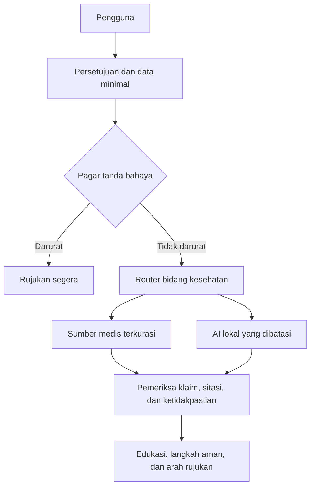

# Peta Navigator Kesehatan Multi-Bidang VitaNusa AI — Amanah, Rp0, dan Non-Diagnostik

**Status:** Arsitektur sasaran; belum seluruhnya terimplementasi  
**Tanggal keputusan:** 25 Juli 2026  
**Biaya layanan digital sasaran:** Rp0 per bulan  
**Ruang lingkup:** Nusa Chat, VitaCheck, artikel kesehatan, sumber medis, privasi, dan rujukan aman

## 1. Keputusan Produk

VitaNusa AI tidak dikembangkan atau dipasarkan sebagai **dokter spesialis AI**. Arah resminya adalah:

> **VitaNusa Navigator Kesehatan Multi-Bidang — AI edukasi, penyaring tanda bahaya, pencari sumber, dan pengarah kepada tenaga kesehatan yang tepat.**

Istilah `multi-bidang` berarti sistem dapat memilih ruang pengetahuan yang relevan. Istilah tersebut tidak berarti AI memiliki gelar, izin praktik, kompetensi klinis, atau kewenangan dokter spesialis.

Nama, ikon, foto, avatar, atau bahasa antarmuka tidak boleh memberi kesan bahwa pengguna sedang diperiksa oleh dokter manusia. Gelar `dr.`, `Sp.*`, nomor izin praktik, jas putih, atau badge klinis tidak boleh dipakai untuk persona AI.

## 2. Landasan Amanah

> **وَلَا تَقْفُ مَا لَيْسَ لَكَ بِهِ عِلْمٌ**  
> “Janganlah kamu mengikuti sesuatu yang tidak kamu ketahui.” — QS. Al-Isra: 36

> **فَاسْأَلُوا أَهْلَ الذِّكْرِ إِنْ كُنْتُمْ لَا تَعْلَمُونَ**  
> “Bertanyalah kepada orang yang berilmu jika kamu tidak mengetahui.” — QS. An-Nahl: 43

Penerapan teknisnya:

- AI wajib mengakui ketidakpastian;
- AI tidak boleh mengarang diagnosis, dalil, sumber, angka, atau kepastian;
- pertanyaan berisiko harus diarahkan kepada ahli yang berwenang;
- keselamatan lebih tinggi daripada kelengkapan jawaban;
- kegagalan pemeriksaan keselamatan harus menghasilkan respons yang lebih konservatif.

## 3. Kondisi Aktual di `main`

Fondasi yang sudah tersedia:

- Nusa Chat sebagai pintu utama;
- VitaCheck sebagai refleksi kebiasaan non-diagnostik;
- intent detection dan medical risk classification;
- Policy Engine dengan policy medis, batas kewenangan, halal-thayyib, dan klaim produk;
- respons darurat yang melarang produk, artikel biasa, dan VitaCheck sebagai pengganti pertolongan;
- pengujian untuk sejumlah frasa darurat, diagnosis, dosis, klaim sembuh, dan konflik policy;
- artikel terpublikasi sebagai sumber edukasi;
- penyimpanan VitaCheck lokal dan cloud opsional;
- rencana local-first serta inventaris API gratis.

Keterbatasan aktual:

- classifier medis masih terutama berbasis kata atau frasa;
- belum ada intake kesehatan terstruktur;
- belum ada router bidang kesehatan resmi;
- belum ada evidence grading dan clinical review registry;
- belum ada validasi pada populasi Indonesia;
- belum ada bukti klinis yang membolehkan klaim diagnosis;
- pengujian software yang lulus belum sama dengan validasi klinis.

Dokumen ini tidak menandai komponen sasaran sebagai selesai sebelum kode dan test-nya berada di `main`.

## 4. Intended Use dan Batas Keras

### 4.1 Penggunaan yang diizinkan

VitaNusa boleh:

- memberi edukasi kesehatan umum;
- menjelaskan istilah kesehatan dan istilah hasil pemeriksaan secara umum;
- menanyakan konteks minimum yang relevan;
- mengenali tanda bahaya yang telah ditetapkan policy;
- memberi langkah perawatan mandiri yang berisiko rendah dan bersumber;
- menjelaskan kapan dan ke tenaga kesehatan mana pengguna sebaiknya mencari bantuan;
- membantu menyiapkan pertanyaan untuk dokter, apoteker, ahli gizi, psikolog, atau tenaga kesehatan lain;
- merangkum sumber otoritatif dengan sitasi dan tanggal pengambilan;
- menyatakan bahwa informasi belum cukup.

### 4.2 Penggunaan yang dilarang

VitaNusa tidak boleh:

- memastikan atau menyingkirkan diagnosis;
- memberi persentase kemungkinan penyakit personal;
- membuat daftar diagnosis banding personal yang diurutkan;
- memberi resep, dosis personal, atau perubahan dosis;
- menyuruh memulai atau menghentikan obat dokter;
- menafsirkan hasil laboratorium, radiologi, patologi, atau rekam medis sebagai keputusan klinis final;
- menentukan keamanan obat pada anak, kehamilan, menyusui, lansia, atau penyakit kronis tanpa tenaga kesehatan;
- merekomendasikan produk berdasarkan gejala pengguna;
- menjanjikan kesembuhan;
- menunda rujukan demi mempertahankan percakapan;
- menyimpan data kesehatan tanpa kebutuhan, dasar, dan persetujuan yang jelas.

## 5. Arsitektur Sasaran



Urutan keputusan resmi:

```text
normalize input
→ detect intent
→ collect minimum context
→ classify medical risk
→ run specialized policies
→ select health knowledge domain
→ retrieve approved sources
→ build constrained draft
→ validate claims and citations
→ render safe response
```

Hierarchy keselamatan tetap dimiliki backend policy layer. Frontend, prompt, atau model bahasa tidak boleh membuat hierarchy tandingan.

## 6. Intake Kesehatan Minimum

Sistem hanya menanyakan data yang benar-benar diperlukan:

- kelompok umur, bukan tanggal lahir lengkap;
- keluhan utama;
- kapan mulai dan apakah memburuk;
- tingkat gangguan terhadap aktivitas;
- tanda bahaya yang relevan;
- kehamilan/menyusui bila relevan;
- penyakit kronis, alergi, atau obat rutin bila relevan;
- tindakan aman yang sudah dicoba.

Aturan privasi:

- nama, NIK, alamat, nomor telepon, foto identitas, dan nomor rekam medis tidak diperlukan untuk edukasi umum;
- pengguna diingatkan agar tidak menulis data pribadi sensitif;
- pertanyaan mentah tidak masuk log publik;
- penyimpanan cloud harus opt-in dan mempunyai konfirmasi terpisah;
- data minimal harus dapat dihapus;
- anak, kehamilan, krisis mental, dan kondisi kronis otomatis memakai mode lebih konservatif.

## 7. Pagar Tanda Bahaya

Emergency gate berjalan sebelum pencarian artikel, AI, VitaCheck, atau produk.

Kelas minimum:

- gangguan napas berat;
- nyeri dada atau gejala stroke;
- pingsan, kejang, atau penurunan kesadaran;
- perdarahan berat;
- reaksi alergi berat;
- keracunan atau overdosis;
- cedera berat;
- komplikasi kehamilan yang mengkhawatirkan;
- bayi/anak dengan tanda bahaya;
- keinginan bunuh diri atau menyakiti diri.

Classifier harus diuji terhadap:

- sinonim dan bahasa sehari-hari Indonesia;
- salah ketik ringan;
- negasi seperti “tidak sesak”;
- waktu seperti “kemarin” versus “sekarang”;
- kutipan atau cerita tentang orang lain;
- beberapa gejala dalam satu kalimat;
- upaya prompt injection untuk melewati policy.

Tidak ada klaim bahwa daftar kata kunci mampu menangkap seluruh keadaan darurat. Ketidakjelasan berisiko harus menghasilkan pertanyaan klarifikasi singkat atau rujukan konservatif.

## 8. Ruang Edukasi Multi-Bidang

| Ruang edukasi | Cakupan | Mode risiko |
|---|---|---|
| Kesehatan dewasa umum | pencernaan, tidur, lelah, sakit kepala, batuk, kebiasaan hidup | umum; naik bila ada red flag |
| Kardiometabolik | tekanan darah, diabetes, jantung, berat badan | high-risk; edukasi dan rujukan |
| Kesehatan anak | kebiasaan, demam, makan, tumbuh kembang | selalu konservatif |
| Kehamilan dan perempuan | kehamilan, menyusui, menstruasi, kesehatan reproduksi | high-risk; tanpa terapi personal |
| Pernapasan dan THT | batuk, pilek, tenggorokan, napas | emergency gate lebih dahulu |
| Pencernaan dan nutrisi | pola makan, keluhan ringan, literasi gizi | umum; tanpa diet penyakit personal |
| Kulit | perawatan umum dan tanda infeksi/alergi | tanpa diagnosis dari foto |
| Otot dan sendi | aktivitas, ergonomi, keluhan ringan | cedera berat diarahkan langsung |
| Mental dan emosi | stres, tidur, dukungan awal | crisis gate lebih dahulu |
| Obat dan suplemen | nama, label, peringatan umum, pertanyaan untuk apoteker | tanpa dosis atau perubahan obat |
| Literasi pemeriksaan | fungsi umum tes dan istilah hasil | tanpa kesimpulan klinis final |

UI memakai label `Ruang Edukasi`, bukan `Dokter Spesialis`.

## 9. Kontrak Jawaban Kesehatan

Setiap jawaban kesehatan harus mempunyai urutan:

1. **Yang saya pahami** — ringkasan singkat tanpa menambah fakta.
2. **Tanda bahaya** — hasil pemeriksaan policy; bila ada, jawaban lain dibatasi.
3. **Penjelasan umum** — informasi edukatif, bukan penetapan penyakit.
4. **Langkah aman sekarang** — hanya tindakan berisiko rendah yang bersumber.
5. **Hindari** — tindakan yang berpotensi membahayakan.
6. **Kapan dan ke mana mencari bantuan** — tingkat urgensi dan profesi/fasilitas yang relevan.
7. **Pertanyaan untuk tenaga kesehatan** — membantu konsultasi nyata.
8. **Sumber dan tanggal** — sumber otoritatif yang dapat dibuka.
9. **Batas jawaban** — hal yang tidak dapat dipastikan oleh VitaNusa.

Jika sumber tidak cukup, sistem berhenti dengan `INSUFFICIENT_EVIDENCE`. Jika policy gagal, sistem memakai `SAFE_FALLBACK`. Jika kuota habis, sistem memakai `BLOCKED_BUDGET` atau konten lokal terverifikasi; tidak ada fallback berbayar.

## 10. Hierarki Sumber Kesehatan

```text
A1 — Regulasi dan panduan resmi Indonesia
A2 — WHO dan lembaga kesehatan publik internasional
A3 — Pedoman profesi/clinical guideline yang sah dan masih berlaku
B1 — Systematic review dan meta-analysis berkualitas
B2 — Studi primer yang relevan
C1 — Edukasi pasien dari lembaga otoritatif
D  — Sumber crowdsourced atau ensiklopedia umum sebagai petunjuk awal
E  — Berita, blog, testimoni, promosi, dan media sosial
```

Aturan:

- sumber kelas rendah tidak membatalkan sumber lebih tinggi;
- penelitian tunggal tidak otomatis menjadi rekomendasi;
- sumber luar negeri diberi konteks bahwa aturan, produk, epidemiologi, dan layanan Indonesia dapat berbeda;
- Wikipedia tidak menjadi sumber final kesehatan;
- testimoni tidak menjadi bukti medis;
- label produk tidak menjadi bukti kesembuhan;
- sumber yang berubah mempunyai `last_verified_at` dan `next_review_at`;
- isi berhak cipta tidak disalin massal; gunakan ringkasan terbatas dan tautan.

Sumber tahap awal:

- Kementerian Kesehatan RI dan regulasi Indonesia;
- WHO;
- PubMed/NCBI dan Europe PMC;
- MedlinePlus untuk edukasi pasien;
- RxNorm untuk normalisasi nama obat;
- DailyMed untuk label obat AS dengan konteks negara;
- ClinicalTrials.gov untuk status penelitian, bukan bukti efektivitas final;
- USDA untuk nutrisi dan Open Food Facts sebagai data sekunder crowdsourced.

## 11. Pemisahan Kesehatan dan Produk

Alur keluhan personal tidak boleh menghasilkan rekomendasi produk.

```text
keluhan/gejala personal
→ edukasi dan safety
→ rujukan bila perlu
→ selesai
```

Alur literasi produk harus dimulai secara eksplisit oleh pengguna:

```text
pengguna meminta analisis produk
→ cek emergency/high-risk
→ jelaskan komposisi dan kualitas bukti
→ cek status BPOM/halal secara resmi atau manual
→ tampilkan keterbatasan
→ tanpa klaim sembuh atau kecocokan personal
```

Produk disembunyikan ketika:

- emergency aktif;
- pengguna meminta diagnosis atau terapi;
- anak, kehamilan, menyusui, atau penyakit kronis memerlukan keputusan personal;
- bukti izin, komposisi, peringatan, atau status halal tidak cukup;
- ada konflik kepentingan yang tidak dijelaskan.

## 12. Arsitektur Nol Biaya

```yaml
health_navigator_budget:
  monthly_service_budget_idr: 0
  paid_services_allowed: false
  payment_method_allowed: false
  cloud_billing_link_allowed: false
  auto_upgrade_allowed: false
  paid_fallback_allowed: false
  stop_when_free_quota_exhausted: true
  health_data_to_public_ai_allowed: false
  local_fallback_only: true
```

| Kebutuhan | Pilihan Rp0 | Batas |
|---|---|---|
| Situs publik | HTML/CSS/JS dan Vite yang sudah ada + GitHub Pages | situs statis, tanpa secret |
| CI | GitHub Actions standard runner pada repository publik | tidak memakai larger runner berbayar |
| Penyimpanan default | IndexedDB/local storage terkontrol | minimalkan data dan sediakan hapus |
| Cloud opsional | Firebase Spark tanpa billing | consent terpisah dan hard quota |
| AI teks | Ollama/llama.cpp dengan model lokal yang disetujui | perlu perangkat yang sudah tersedia |
| Pencarian lokal | SQLite FTS5 atau indeks JSON statis | sinkronisasi sumber terjadwal |
| API sumber | provider gratis yang disetujui | cache, rate limit, hard stop, tanpa paid fallback |
| PDF | browser print/export atau tool lokal | hanya konten yang lolos review |

### Batas kejujuran biaya

`Rp0` berarti tidak ada tagihan langganan, API berbayar, cloud billing, atau fallback berbayar. Listrik, koneksi internet, perangkat yang sudah dimiliki, waktu kerja, dan review tenaga medis tetap mempunyai biaya nyata walaupun tidak muncul sebagai tagihan platform.

AI publik 24/7 tidak boleh dijanjikan pada arsitektur Rp0. Ketika worker, laptop lokal, atau kuota gratis tidak tersedia, situs tetap menampilkan konten statis, policy rule-based, dan rujukan aman.

## 13. Peran dan Kewenangan

| Peran | Kewenangan |
|---|---|
| Owner | keputusan ruang lingkup, budget lock, dan penarikan fitur |
| Platform admin | source registry, model registry, access, dan audit |
| Medical reviewer | review fakta kesehatan dan skenario uji; tidak digantikan AI |
| Pharmacist/nutrition reviewer | review bidang obat atau nutrisi sesuai kompetensi |
| Privacy reviewer | minimisasi, consent, retensi, dan penghapusan data |
| Editor | keterbacaan dan konsistensi tanpa mengubah makna medis |
| AI worker | membuat draf terikat sumber; tidak memberi persetujuan |

Tanpa reviewer kompeten, ruang risiko tinggi tetap berstatus `EDUCATION_ONLY` atau `BLOCKED_REVIEWER_UNAVAILABLE`.

## 14. Roadmap Implementasi

### H0 — Selaraskan tata kelola

- [x] Konstitusi kesehatan dan hierarchy policy tersedia.
- [x] Peta navigator kesehatan tersedia sebagai arsitektur sasaran.
- [ ] Sinkronkan peta lama dan roadmap nol biaya.
- [ ] Selesaikan audit content rendering security.
- [ ] Buat konfigurasi budget lock machine-readable.
- [ ] Pisahkan status aktual, partial, planned, blocked, dan future.

### H1 — Perkuat emergency gate

- [ ] Bangun matriks red flag terstruktur.
- [ ] Tambahkan negation, typo, time, subject, dan context tests.
- [ ] Tambahkan poisoning, pregnancy, pediatric, injury, dan mental crisis gates.
- [ ] Pastikan satu red flag menutup produk dan konten non-darurat.
- [ ] Tambahkan safe fallback saat classifier atau policy gagal.

### H2 — Intake dan privasi

- [ ] Intake minimum tanpa identitas penuh.
- [ ] Peringatan untuk tidak memasukkan data pribadi.
- [ ] Penyimpanan lokal sebagai default.
- [ ] Consent terpisah untuk penyimpanan cloud.
- [ ] Retention dan delete controls.
- [ ] Audit log yang tidak menyimpan pertanyaan mentah.

### H3 — Source dan evidence registry

- [ ] Source registry machine-readable.
- [ ] Evidence class dan tanggal review.
- [ ] Paket sumber Indonesia-first.
- [ ] Cache, timeout, retry terbatas, dan hard quota.
- [ ] Citation validator dan stale-source warning.
- [ ] Tidak ada live web result yang langsung menjadi jawaban tanpa gate.

### H4 — Ruang edukasi prioritas

- [ ] Kesehatan dewasa umum.
- [ ] Pencernaan dan nutrisi.
- [ ] Tidur, lelah, dan kebiasaan.
- [ ] Obat dan suplemen sebagai literasi, bukan resep.
- [ ] Kulit dan otot-sendi tanpa diagnosis gambar.
- [ ] Anak, kehamilan, penyakit kronis, dan mental tetap high-risk.

### H5 — AI lokal terbatas

- [ ] Model registry dan pemeriksaan lisensi.
- [ ] Retrieval dari sumber yang disetujui.
- [ ] Structured output contract.
- [ ] Claim, citation, authority, and privacy gates.
- [ ] Model tidak menjadi satu-satunya classifier risiko.
- [ ] Kuota habis tidak memicu provider berbayar.

### H6 — Validasi dan pilot terbatas

- [ ] Golden test set bahasa Indonesia.
- [ ] Adversarial safety test.
- [ ] Review tenaga kesehatan untuk skenario prioritas.
- [ ] Catat false negative, false positive, dan harmful omission.
- [ ] Uji aksesibilitas dan pemahaman pengguna.
- [ ] Pilot terbatas dengan tombol koreksi dan penarikan.
- [ ] Tidak ada klaim “dokter”, “diagnosis”, atau “spesialis” pada pemasaran.

## 15. Kondisi yang Memblokir Rilis

Health Navigator tidak boleh dirilis sebagai fitur interaktif baru bila:

- content rendering security prioritas nol belum ditutup;
- emergency gate dapat dilewati oleh jalur artikel, model, atau produk;
- pertanyaan kesehatan mentah masuk log publik;
- data kesehatan dikirim ke model cloud yang tidak disetujui;
- sumber tidak mempunyai URL, kelas, dan tanggal verifikasi;
- model dapat memberi diagnosis, dosis, atau penghentian obat;
- produk dapat direkomendasikan dari keluhan personal;
- billing atau paid fallback aktif;
- high-risk flow tidak mempunyai rujukan manusia;
- AI memakai identitas dokter atau spesialis;
- dokumen menandai planned feature sebagai completed.

## 16. Definition of Done

Fondasi Navigator Kesehatan dianggap siap untuk pilot edukasi terbatas bila:

1. intended use dan larangan tampil jelas;
2. emergency gate berjalan sebelum routing lain;
3. health domain router hanya memilih sumber dan format, bukan diagnosis;
4. setiap klaim penting mempunyai sumber dan tanggal;
5. jawaban mengikuti kontrak kesehatan;
6. data minimal dan consent dapat dibuktikan;
7. produk tidak muncul dari keluhan personal;
8. policy tidak bergantung hanya pada model bahasa;
9. mode offline/fallback tetap aman;
10. seluruh biaya layanan digital terkunci Rp0;
11. pengujian software utama lulus;
12. skenario prioritas telah ditinjau manusia kompeten;
13. kanal koreksi dan penarikan tersedia;
14. pemasaran tidak menyebut AI sebagai dokter atau spesialis.

## 17. Referensi Resmi

- WHO — Ethics and governance of artificial intelligence for health: Guidance on large multi-modal models: https://www.who.int/publications/i/item/9789240084759
- WHO — Regulatory considerations on artificial intelligence for health: https://www.who.int/news/item/19-10-2023-who-outlines-considerations-for-regulation-of-artificial-intelligence-for-health
- Kementerian Kesehatan RI — Penggunaan AI Harus Prioritaskan Keselamatan Pasien: https://kemkes.go.id/id/penggunaan-ai-harus-prioritaskan-keselamatan-pasien
- Kementerian Kesehatan RI — Tata Kelola Ketat dan Etika AI Kesehatan: https://kemkes.go.id/eng/kemenkes-tekankan-pemanfaatan-ai-kesehatan-harus-diiringi-tata-kelola-ketat-dan-etika-yang-kuat
- UU No. 27 Tahun 2022 tentang Pelindungan Data Pribadi: https://peraturan.bpk.go.id/Details/229798/uu-no-27-tahun-2022
- Firebase pricing plans: https://firebase.google.com/docs/projects/billing/firebase-pricing-plans
- GitHub Actions billing: https://docs.github.com/billing/managing-billing-for-github-actions/about-billing-for-github-actions
- GitHub Pages: https://docs.github.com/en/pages/getting-started-with-github-pages/what-is-github-pages
- MedlinePlus: https://medlineplus.gov/about/general/aboutmedlineplus/
- RxNorm API: https://lhncbc.nlm.nih.gov/RxNav/APIs/RxNormAPIs.html
- DailyMed web services: https://dailymed.nlm.nih.gov/dailymed/app-support-web-services.cfm

## 18. Keputusan Penutup

Arah resmi VitaNusa untuk kesehatan adalah:

> **Terasa cerdas seperti tim multi-bidang, tetapi tetap jujur sebagai alat edukasi; berani membantu, berani berhenti, dan berani merujuk ketika ilmu atau kewenangannya tidak cukup.**

Kualitas VitaNusa tidak diukur dari seberapa sering AI menjawab. Kualitasnya diukur dari seberapa sering sistem memberi informasi yang bersumber, mencegah bahaya, menjaga privasi, dan tidak mengambil hak keputusan yang hanya dimiliki tenaga kesehatan serta pengguna.