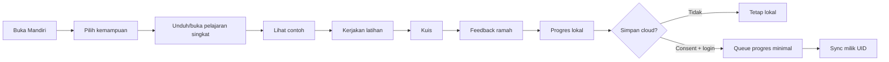

# 03 — Users and Journeys

Persona bersifat peran dan kebutuhan, bukan profil demografis. Satu manusia dapat memiliki beberapa peran, tetapi izin selalu dievaluasi per konteks dan workspace.

## Persona

| Persona | Tujuan | Hambatan/kemampuan digital | Offline dan aksesibilitas | Data yang digunakan | Boleh | Tidak boleh |
| --- | --- | --- | --- | --- | --- | --- |
| Pelajar mandiri | Belajar keterampilan sehari-hari dalam unit pendek | Dapat memerlukan bahasa sederhana dan contoh berulang | Materi teks offline, target besar, status tanpa stigma | Progres, attempt, preferensi lokal | Belajar, menghapus/export progres sendiri, memberi consent mentor | Membaca progres orang lain atau dianggap setara pendidikan formal |
| Mentor | Memberi arahan berdasarkan progres terbatas | Membutuhkan ringkasan yang dapat dijelaskan | Tampilan ringan, scope consent jelas | Hanya progress scope yang diizinkan | Melihat scope aktif, memberi catatan terpisah bila kelak disetujui | Melihat kesehatan/usaha atau progres setelah revoke/expiry |
| Pemilik usaha | Mencatat produk, stok, kas, penjualan, dan laporan | Mungkin memakai satu ponsel untuk banyak tugas | Transaksi inti offline, backup jelas, tombol besar | Seluruh data workspace yang dimiliki | Kelola anggota, data, export, void sesuai rule | Menghilangkan owner terakhir atau mengubah transaksi final diam-diam |
| Kasir | Menyelesaikan transaksi dengan langkah minimal | Membutuhkan error yang langsung dapat diperbaiki | Penjualan tetap berjalan offline dalam workspace yang telah diprovision | Produk, sesi kas, sale yang dibuat, izin terbatas | Buka/operasikan kas sesuai izin, buat sale, cetak/share struk bila tersedia | Mengangkat role, hapus workspace, ubah laporan atau sale final |
| Platform owner | Menjaga operasi dan akun admin platform | Mampu meninjau perubahan sensitif | Admin tetap network-only | Konfigurasi platform dan konten publik | Kelola platform admin dan materi | Tenant bypass otomatis atau membaca progres privat |
| Platform admin | Mengelola konten/materi platform | Menggunakan dashboard existing | Admin network-only | Konten published dan metadata operasional | Kelola materi sesuai policy | Mengelola admin lain atau data tenant |
| Pengguna VitaNusa umum | Memakai Nusa Chat, artikel, VitaCheck, akun opsional | Beragam | PWA/fallback existing | Data inti VitaNusa sesuai consent | Memakai fitur inti tanpa Mandiri | Datanya digabung ke workspace tanpa persetujuan |

## Journey pelajar

Pelajar selalu dapat berhenti setelah penyimpanan lokal. Login tidak memicu upload lama. Rekomendasi pelajaran berikut berasal dari progres unit dan prasyarat yang transparan, bukan diagnosis kemampuan atau skor kecerdasan.

## Journey pemilik usaha

```mermaid
flowchart LR
    A["Aktifkan fitur Mandiri"] --> B["Buat workspace lokal"]
    B --> C["Tambah produk"]
    C --> D["Catat stok awal"]
    D --> E["Buka sesi kas"]
    E --> F["Buat penjualan"]
    F --> G["Catat pembayaran"]
    G --> H["Catat pengeluaran"]
    H --> I["Tutup kas"]
    I --> J["Periksa laporan"]
    J --> K["Ekspor CSV/backup"]
```

Pada local MVP semua langkah berada dalam satu database perangkat dan transaksi IndexedDB atomik. Pada fase cloud, tiap aksi menambah outbox record; UI menandai pending tanpa membuat sale kedua.

## Journey kasir

1. Login dan pilih workspace yang membership-nya telah tersedia.
2. Buka atau pilih sesi kas yang diizinkan.
3. Cari produk aktif dan masukkan jumlah.
4. Sistem membekukan snapshot nama/harga pada draft sale.
5. Kasir memasukkan jumlah pembayaran dan meninjau kembalian deterministik.
6. Konfirmasi membuat sale final, payment, stock movement, audit event, dan outbox secara atomik.
7. Struk dibuat dari sale final, bukan dari state keranjang.
8. Kasir menutup sesi hanya bila permission dan kebijakan MVP mengizinkan; penutupan tidak menghapus transaksi.

## Journey mentor

1. Pelajar memilih **Beri akses mentor**, memilih scope course/progress, dan expiry bila tersedia.
2. Sistem membuat invitation sekali pakai tanpa memasukkan data progres ke undangan.
3. Mentor login dan menerima undangan.
4. Rules mengevaluasi grant aktif pada setiap read.
5. Mentor melihat ringkasan terbatas, bukan data kesehatan atau usaha.
6. Pelajar dapat revoke kapan saja; read berikutnya ditolak dan cache mentor dibersihkan.

## Journey kegagalan offline

1. UI menerima command yang valid dan menyimpannya lokal bersama outbox.
2. Status menunjukkan **Tersimpan di perangkat — menunggu sinkronisasi**.
3. Bila auth kedaluwarsa, retry berhenti pada `blocked_auth`; data lokal tidak dihapus.
4. Setelah login ulang, worker mencoba operation ID yang sama.
5. Acknowledgement existing dianggap sukses idempotent, bukan duplicate error.
6. Conflict bisnis ditampilkan untuk keputusan pemilik; sale final tidak ditimpa.

## Kebutuhan lintas journey

- Tidak ada layar yang hanya mengandalkan warna untuk status pending/error/success.
- Logout pada perangkat bersama menawarkan pembersihan data akun lokal tanpa menghapus backup/cloud secara implisit.
- Peralihan akun mengunci database namespace lama sebelum membuka namespace akun baru.
- Semua export menjelaskan workspace, periode, waktu pembuatan, timezone, dan sifat estimasi.
- Semua consent dapat dibaca, dibatalkan, dan tidak digabung dengan consent kesehatan.
