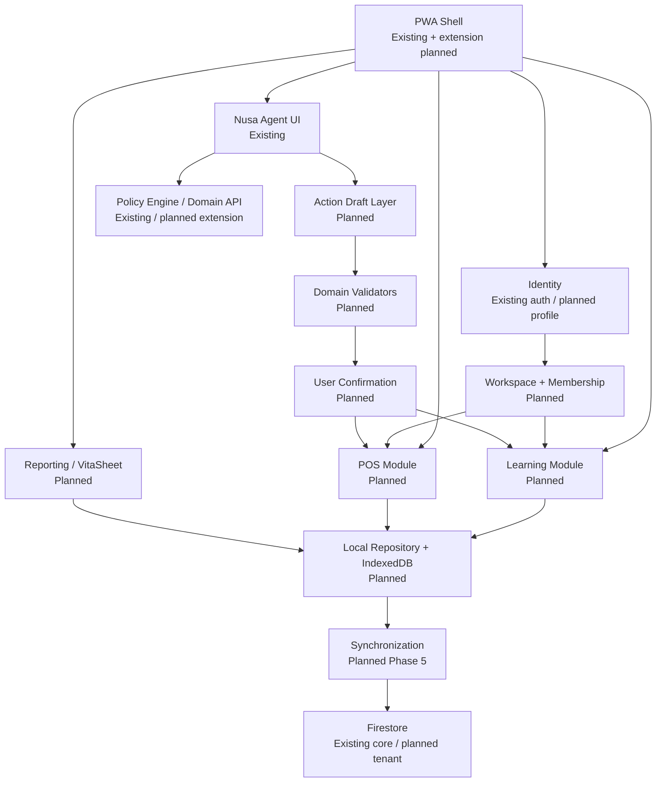

# 04 — Domain and Module Map

Status komponen pada dokumen ini: `Existing`, `Planned`, atau `Deferred`. Nama modul planned adalah boundary, bukan janji path final.

## Module dependency



Dependency diarahkan ke domain service, bukan dari domain ke DOM atau LLM. Local repository menjadi port agar Fase 1–4 tidak bergantung pada Firestore. Sinkronisasi baru ditambahkan setelah repository contract stabil.

## Versi teks

```text
PWA Shell
├── Identity (existing auth, planned workspace identity)
├── Learning Module (planned)
├── POS Module (planned)
├── Reporting Module (planned)
├── Local Repository → IndexedDB (planned)
├── Synchronization → Firestore (planned, later phase)
└── Nusa Agent UI (existing)
    └── Action Draft → Domain Validation → User Confirmation → Domain Service (planned)
```

## Katalog domain

Kolom “boundary” menyatakan transaksi atomik atau konsistensi yang harus dijaga. Endpoint adalah kemungkinan, bukan endpoint existing.

| Domain | Tanggung jawab; entity | Input → output | Dependency; boundary | Data privat/risiko | Modul frontend; endpoint kandidat; test |
| --- | --- | --- | --- | --- | --- |
| Identity | Profil minimal; `UserProfile` | Auth state → actor context | Firebase Auth; tidak menulis membership | User-private; shared device | `identity-service`; none; auth/session tests |
| Workspace | Batas tenant; `Workspace` | create/update metadata → workspace | Identity; create workspace + owner atomik | Tenant-private; orphan owner | `workspace-service`; `/workspaces`; invariant owner tests |
| Membership | Role tenant; `WorkspaceMember`, `Invitation` | invitation/accept → membership | Workspace/Identity; accept invite sekali | Email/UID; escalation/brute force | `membership-service`; `/members`; Rules/replay tests |
| Learning | Struktur belajar; `Course`, `Lesson`, `Activity` | package → rendered unit | Curriculum; content version boundary | Public/internal; stale content | `learning-engine`; package endpoint; schema/a11y tests |
| Curriculum | Publikasi materi | draft/review → versioned package | Platform content policy; publish immutable version | Internal; unsafe/merendahkan copy | `content-package`; `/learning/packages`; review tests |
| Assessment | Latihan/kuis; `Exercise`, `Quiz`, `QuizAttempt` | answers → deterministic score | Learning; attempt immutable | Sensitive educational; label harm | `assessment-engine`; optional sync; scoring tests |
| Product | Katalog tenant; `Product`, `ProductCategory` | owner input → active product | Workspace/money; versioned update | Tenant-private; XSS/price tamper | `product-repository`; `/products`; schema/XSS tests |
| Inventory | Movement dan balance; `StockMovement`, `InventoryBalance` | movement → projected balance | Product/Sales; movement append + snapshot | Sensitive business; negative/race | `inventory-service`; `/stock-movements`; invariant tests |
| Sales | Keranjang ke sale final; `Sale`, `SaleLine` | validated cart → immutable sale | Money/Inventory/Cash; atomic finalization | Sensitive financial; duplicate/tamper | `sales-service`; `/sales`; calculation/idempotency tests |
| Payment | Pencatatan tender; `Payment` | amount/method → paid/change state | Sales/Money; belongs to one sale | Sensitive financial; false “paid” | `payment-service`; within sale command; arithmetic tests |
| Expense | Pengeluaran; `Expense` | amount/category/note → immutable record | Cash/Workspace; create-only pada MVP, correction deferred | Sensitive financial; arbitrary note | `expense-service`; `/expenses`; permission/schema tests |
| Cash Session | Shift dan ledger laci; `CashSession`, `CashMovement` | opening/sale/expense/in/out/count → expected/difference | Sales/Expense; movement append-only dan one open session policy | Sensitive financial; forced close/tampered cash | `cash-session-service`; `/cash-sessions`; lifecycle/reconciliation tests |
| Report | Read model deterministik; `Report` | period/filter → totals | Sales/Inventory/Expense/Cash | Sensitive financial; stale/cross tenant | `report-query`; `/reports`; reconciliation tests |
| Export | Portable output; `ExportJob` | snapshot + format → file | Report/Privacy; fixed snapshot boundary | Data exfiltration/formula injection | `export-service`; `/exports`; sanitization tests |
| Import | Preview/commit; `ImportJob` | file → validation preview → commands | Product/Inventory; no write before confirm | Malicious file/cross tenant | `import-service`; `/imports`; parser/fuzz tests |
| Offline Storage | Durable local state | domain command → atomic records | IndexedDB; state + outbox transaction | Device-private; stale shared device | `mandiri-db`; none; migration/restart tests |
| Synchronization | Outbox and acknowledgement; `SyncOperation` | pending op → receipt/conflict | Auth/Cloud; idempotent per operation ID | Tenant-private; replay/duplication | `sync-engine`; `/sync/operations`; chaos tests |
| Audit | Minimal event; `AuditEvent` | domain result → append event | Every command; event append with outcome | Internal tenant; over-logging | `audit-repository`; `/audit`; redaction/access tests |
| Nusa Agent Action | Draft/confirmation; `AgentActionDraft` | text → structured draft → command | Agent/Role/Domain; fresh check at execute | Prompt and business data; injection | `agent-action`; `/actions/execute`; safety/replay tests |
| Privacy | Consent/export/delete | request → scoped operation | Identity/all domains; per-domain workflow | All classifications; accidental cascade | `privacy-controls`; `/privacy`; deletion/isolation tests |

## Dependency rules

1. UI boleh memanggil application service, tidak boleh menulis IndexedDB/Firestore secara ad hoc.
2. Domain arithmetic tidak bergantung pada browser locale, DOM, network, atau LLM.
3. Repository local dan cloud mengimplementasikan port yang sama tetapi tidak menyembunyikan status pending/conflict.
4. Reporting hanya membaca committed entity; draft keranjang tidak masuk laporan.
5. Export menerima immutable report snapshot sehingga total dan baris berasal dari cut-off yang sama.
6. Agent tidak memanggil repository; ia menghasilkan command draft yang masuk validation/confirmation pipeline.
7. Platform admin tooling tidak menjadi dependency workspace repository.

## Transaction boundaries

- **Create workspace local:** workspace + owner membership + audit + outbox dalam satu transaksi.
- **Finalize sale:** sale + lines + payment + stock movements + cash impact + audit + outbox dalam satu transaksi IndexedDB.
- **Void sale:** `SaleReversal` + reversal movements + cash reversal + audit + outbox; original Sale tidak diubah. Status void pada UI/report diturunkan dari reversal.
- **Accept invitation cloud:** consume token + create membership + audit dalam satu transaction/server command.
- **Confirm Agent action:** consume confirmation token + execute idempotent command + audit + receipt; model output bukan bagian dari trusted boundary.

## Deferred boundaries

Payment gateway, tax engine, double-entry accounting, payroll, barcode, Bluetooth print, and multi-branch aggregation tidak memiliki module contract dalam MVP. Menambahnya memerlukan ADR dan threat-model update.
