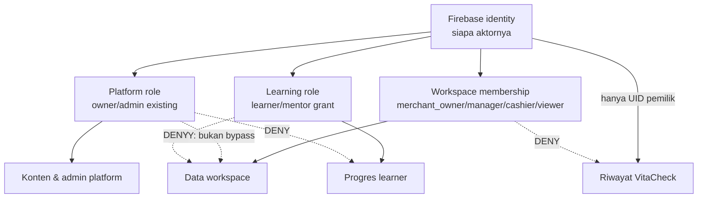

# 05 — Role and Permission Matrix

Status: **Proposed**. Model ini memisahkan otoritas platform, workspace usaha, dan pembelajaran. Role tidak diwariskan antar-domain.

## Namespace role

### Platform

- `platform_owner`: mengelola akun admin platform dan seluruh konten platform.
- `platform_admin`: mengelola konten platform, bukan akun admin lain atau data privat tenant.

Implementasi existing masih memakai nilai `owner` dan `admin` pada `admins/{uid}`. Nama berawalan `platform_` adalah bahasa arsitektur agar tidak tertukar dengan `merchant_owner`; perubahan runtime atau migrasi tidak termasuk Fase 0.

### Workspace usaha

- `merchant_owner`: pemilik workspace, anggota, export, dan data usaha.
- `manager`: operasi luas tanpa transfer/hapus kepemilikan; **post-MVP**.
- `cashier`: penjualan dan sesi kas sesuai scope.
- `viewer`: baca laporan terbatas; **post-MVP**.

MVP local/cloud pertama direkomendasikan hanya mengimplementasikan `merchant_owner` dan `cashier`. Role manager/viewer tetap dimodelkan agar ekspansi tidak memaksa perubahan schema, tetapi UI dan Rules-nya belum boleh dibuka sebelum test khusus tersedia.

### Pembelajaran

- `learner`: pemilik progres belajar.
- `mentor`: pembaca progres terbatas berdasarkan grant learner yang aktif.

## Batas role

Auth hanya membuktikan identity. Setiap resource memerlukan pemeriksaan boundary sendiri. Bahkan bila UID yang sama adalah platform owner dan merchant owner, akses tenant berasal dari membership workspace, bukan role platform.

## Legenda

- **A** — Allow sesuai schema dan precondition.
- **D** — Deny.
- **O** — Owner only.
- **C** — Consent/grant aktif diperlukan.
- **N** — Not in MVP.

## Matriks tindakan

| Tindakan | Platform owner | Platform admin | Merchant owner | Manager | Cashier | Viewer | Learner | Mentor |
| --- | --- | --- | --- | --- | --- | --- | --- | --- |
| Membuat workspace | D | D | A, aktor menjadi owner | D | D | D | D | D |
| Mengundang anggota | D | D | O | N | D | D | D | D |
| Mengubah role anggota | D | D | O | D | D | D | D | D |
| Melihat produk | D | D | A | N | A | N | D | D |
| Mengubah produk | D | D | A | N | D | D | D | D |
| Mengubah stok | D | D | A | N | terbatas pada movement penjualan | D | D | D |
| Membuat transaksi | D | D | A | N | A | D | D | D |
| Membatalkan transaksi | D | D | O | N | D | D | D | D |
| Membuka kas | D | D | A | N | A | D | D | D |
| Menutup kas | D | D | A | N | A bila kebijakan workspace mengizinkan | D | D | D |
| Melihat laporan | D | D | A | N | laporan sesi sendiri/terbatas | N | D | D |
| Ekspor data usaha | D | D | O | N | D | N | D | D |
| Hapus workspace | D | D | O + re-auth + grace period | D | D | D | D | D |
| Melihat progres belajar | D | D | D | D | D | D | A, milik sendiri | C, hanya scope grant |
| Mengelola materi publik | A | A | D | D | D | D | D | D |
| Melihat audit log workspace | D | D | O | N | hanya receipt operasi sendiri | D | D | D |
| Mengelola admin platform | O | D | D | D | D | D | D | D |
| Membaca riwayat VitaCheck pengguna lain | D | D | D | D | D | D | D | D |

## Invariant otorisasi

1. Pengguna tidak dapat mengubah membership sendiri menjadi role lebih tinggi.
2. Kasir tidak dapat membuat undangan atau mengangkat anggota.
3. Workspace harus selalu memiliki sekurangnya satu `merchant_owner` aktif.
4. Owner terakhir tidak dapat keluar, dihapus, dinonaktifkan, atau diturunkan tanpa transfer kepemilikan atomik.
5. Transfer owner memerlukan target member aktif, re-auth aktor, konfirmasi spesifik, dan audit event.
6. Role platform tidak pernah menjadi fallback ketika membership tidak ditemukan.
7. Cache permission hanya untuk UX; write selalu memeriksa state terbaru atau precondition versi yang telah ditentukan.
8. Mentor bukan workspace member dan tidak mendapat data usaha atau VitaCheck.
9. Consent mentor spesifik pada learner, scope, status, dan optional expiry; revoke berlaku pada read berikutnya.
10. LLM, route, atau tampilan tombol tidak dapat memberikan permission.

## Permission decision contract

Application service planned menerima `actorUid`, `resourceScope`, `action`, `membershipVersion`, dan `entityVersion`. Ia mengembalikan `allow|deny`, `reasonCode`, serta precondition yang diperlukan. UI hanya merender hasil. Rules atau server command handler mengulang pemeriksaan pada boundary tepercaya.

Contoh reason code aman: `not_authenticated`, `not_member`, `role_denied`, `owner_transfer_required`, `consent_missing`, `consent_expired`, `version_conflict`, dan `workspace_suspended`. Pesan tidak boleh membocorkan keberadaan workspace yang tidak dapat diakses.
