# 07 — Firestore Architecture

Status: **Proposed — belum diterapkan dan `firestore.rules` tidak berubah pada Fase 0**.

## Tujuan

Hierarchy harus membuat tenant boundary terlihat pada path, mendukung query workspace, menjaga learning user-private, tidak memberi platform admin bypass, dan memungkinkan deletion/export per pemilik. Financial write authority dan lokasi sync validator masih `Needs validation` sebelum Fase 5.

## Alternatif A — nested workspace (recommended)

```text
workspaces/{workspaceId}
  members/{uid}
  invitations/{invitationId}
  categories/{categoryId}
  products/{productId}
  inventoryBalances/{productId}
  stockMovements/{movementId}
  sales/{saleId}
  saleLines/{saleId_lineNo}
  payments/{paymentId}
  saleReversals/{reversalId}
  expenses/{expenseId}
  cashMovements/{movementId}
  cashSessions/{sessionId}
  auditEvents/{eventId}
  operationReceipts/{operationId}

users/{uid}/learningProfile/main
users/{uid}/learningProgress/{progressId}
users/{uid}/quizAttempts/{attemptId}
users/{uid}/mentorGrants/{grantId}

learningContent/{contentVersion}/courses/{courseId}
```

Kelebihan: boundary tenant eksplisit, export/delete workspace mudah, Rules membership dapat memakai path yang stabil, dan query tidak perlu filter `workspaceId` agar aman. Kekurangan: collection-group query global harus dihindari atau diotorisasi sangat hati-hati; membership lookup menambah rule reads; cascade delete perlu worker/tool khusus.

## Alternatif B — top-level per entity

```text
workspaces/{workspaceId}
workspaceMembers/{workspaceId_uid}
products/{productId}        # field workspaceId
sales/{saleId}              # field workspaceId
stockMovements/{movementId} # field workspaceId
```

Kelebihan: collection-group/reporting lintas workspace secara teknis mudah dan index seragam. Kekurangan: setiap query wajib membawa filter tenant yang benar, path tidak mengkomunikasikan ownership, Rules lebih mudah salah, deletion/export memerlukan banyak query, dan platform analytics berisiko menjadi jalur kebocoran. Tidak direkomendasikan untuk MVP.

## Alternatif C — user-centric copies

```text
users/{uid}/workspaces/{workspaceId}
users/{uid}/workspaceData/{entityId}
```

Kelebihan: self-owned Rules sederhana dan offline per pengguna. Kekurangan: duplikasi antaranggota, konflik copy, transfer ownership sulit, sale dapat berbeda antarperangkat, serta penghapusan anggota membingungkan. Ditolak untuk data usaha bersama; tetap cocok untuk learning progress milik user.

## Decision matrix

| Kriteria | A Nested workspace | B Top-level | C User copies |
| --- | --- | --- | --- |
| Isolasi tenant | Kuat dan terlihat | Bergantung filter/Rules | Self-bound tetapi data bersama terduplikasi |
| Query workspace | Sederhana | Perlu filter/index | Terfragmentasi |
| Rules | Membership lookup konsisten | Banyak pengulangan workspaceId | Mudah untuk self, buruk untuk kolaborasi |
| Biaya baca | Membership get dapat dicache Rules per request | Serupa, index lebih banyak | Duplikasi read/write tinggi |
| Offline cache | Natural per subcollection | Dapat bekerja | Konflik copy tinggi |
| Export/backup | Traversal satu root | Banyak query top-level | Harus merge copy |
| Deletion | Root-scoped worker | Banyak query | Banyak pemilik/copy |
| Risiko index | Moderat | Tinggi | Moderat |
| Kompleksitas | Moderat | Tinggi secara security | Tinggi secara konsistensi |

Rekomendasi: **Alternatif A untuk usaha dan struktur user-centric khusus data belajar**. Pilihan ini berstatus Proposed dan harus divalidasi dengan Emulator, cost model, dan spike query sebelum diterima.

## Hierarchy diagram

```mermaid
flowchart TB
    db["Firestore — Proposed"]
    ws["workspaces/{workspaceId}"]
    members["members/{uid}"]
    products["products/{productId}"]
    inventory["stockMovements + balances"]
    sales["sales/{saleId}"]
    lines["saleLines/{saleId_lineNo}"]
    payments["payments/{paymentId}"]
    reversals["saleReversals/{reversalId}"]
    cashMovements["cashMovements/{movementId}"]
    ops["operationReceipts/{operationId}"]
    audit["auditEvents/{eventId}"]
    users["users/{uid}"]
    progress["learningProgress"]
    attempts["quizAttempts"]
    grants["mentorGrants"]
    health["vitaCheckHistory — Existing"]
    content["learningContent/{version}"]

    db --> ws
    ws --> members
    ws --> products
    ws --> inventory
    ws --> sales
    ws --> lines
    ws --> payments
    ws --> reversals
    ws --> cashMovements
    ws --> ops
    ws --> audit
    db --> users
    users --> progress
    users --> attempts
    users --> grants
    users --> health
    db --> content
```



Walaupun learning dan VitaCheck sama-sama berada di bawah root user existing, keduanya tetap subcollection dan policy terpisah. Grant mentor hanya berlaku pada progress/attempt scope yang disebut; tidak pernah pada `vitaCheckHistory`.

## Pseudo-Rules

Kode berikut sengaja pseudo-code untuk review arsitektur dan bukan sintaks siap deploy.

```text
signedIn() = request.auth != null
member(workspaceId) = get(workspaces/{workspaceId}/members/{auth.uid})
activeMember(workspaceId) = signedIn && member.status == active
hasWorkspaceRole(workspaceId, roles) = activeMember && member.role in roles

match workspaces/{workspaceId}:
  get/list: activeMember(workspaceId)
  create: signedIn && validWorkspace(data) && createsSelfAsMerchantOwnerAtomically
  update: hasWorkspaceRole(workspaceId, [merchant_owner])
    && validWorkspaceUpdate && keepsAtLeastOneOwner
  delete: false  # deletion workflow, not direct client delete

match workspaces/{workspaceId}/members/{uid}:
  get: auth.uid == uid || hasWorkspaceRole(workspaceId, [merchant_owner])
  list/create/update/delete: hasWorkspaceRole(workspaceId, [merchant_owner])
    && validMembership
    && noSelfPromotion
    && keepsAtLeastOneOwner

match workspaces/{workspaceId}/invitations/{invitationId}:
  read/create/update: hasWorkspaceRole(workspaceId, [merchant_owner])
    && validInvitationTransition
  accept: signedIn && validOneTimeInvitation && createsOwnMembershipAtomically
  delete: false

match workspaces/{workspaceId}/categories/{categoryId}:
  read: activeMember(workspaceId)
  create/update: hasWorkspaceRole(workspaceId, [merchant_owner])
    && validCategory
  delete: false

match workspaces/{workspaceId}/products/{productId}:
  read: activeMember(workspaceId)
  create/update: hasWorkspaceRole(workspaceId, [merchant_owner])
    && validProduct
  delete: false  # inactive, not physical delete

match workspaces/{workspaceId}/inventoryBalances/{productId}:
  read: activeMember(workspaceId)
  direct client create/update/delete: false  # verified read model only

match workspaces/{workspaceId}/sales/{saleId}:
  read: activeMember(workspaceId) according to report scope
  create: hasWorkspaceRole(workspaceId, [merchant_owner, cashier])
    && validImmutableSale
    && operationReceiptIsCreatedWithSameOperationId
  update/delete: false

match workspaces/{workspaceId}/saleLines/{lineId}:
  read: activeMember(workspaceId) according to report scope
  create: hasWorkspaceRole(workspaceId, [merchant_owner, cashier])
    && validImmutableSaleLine
    && parentSaleCreatedInSameTrustedCommand
  update/delete: false

match workspaces/{workspaceId}/payments/{paymentId}:
  read: activeMember(workspaceId) according to report scope
  create: hasWorkspaceRole(workspaceId, [merchant_owner, cashier])
    && validImmutablePayment
    && parentSaleCreatedInSameTrustedCommand
  update/delete: false

match workspaces/{workspaceId}/saleReversals/{reversalId}:
  read: activeMember(workspaceId) according to report scope
  create: hasWorkspaceRole(workspaceId, [merchant_owner])
    && validReversal
    && originalSaleExists
    && operationReceiptIsCreatedWithSameOperationId
  update/delete: false

match workspaces/{workspaceId}/cashMovements/{movementId}:
  read: activeMember(workspaceId) according to report scope
  create: permitted trusted command
    && validAppendOnlyCashMovement
    && (sourceCreatedInSameCommand || explicitInOutByMerchantOwner)
  update/delete: false

match workspaces/{workspaceId}/stockMovements/{movementId}:
  read: activeMember(workspaceId)
  create: permitted trusted command && validMovement
  update/delete: false

match workspaces/{workspaceId}/expenses/{expenseId}:
  read: activeMember(workspaceId) according to report scope
  create: hasWorkspaceRole(workspaceId, [merchant_owner])
    && validImmutableExpense
  update/delete: false

match workspaces/{workspaceId}/cashSessions/{sessionId}:
  read: activeMember(workspaceId) according to report scope
  create: hasWorkspaceRole(workspaceId, [merchant_owner, cashier])
    && validOpenCashSession
  update: hasWorkspaceRole(workspaceId, [merchant_owner, cashier])
    && validOneWayCloseTransition && cashierClosePolicyAllows
  delete: false

match workspaces/{workspaceId}/auditEvents/{eventId}:
  read: hasWorkspaceRole(workspaceId, [merchant_owner])
  create: permitted trusted command && validMinimalAuditEvent
  update/delete: false

match workspaces/{workspaceId}/operationReceipts/{operationId}:
  get: activeMember(workspaceId) && receiptActorIsRequester
  create: permitted trusted command && validOperationReceipt
  list/update/delete: false

match users/{uid}/learningProfile/main:
  read/delete: signedIn && auth.uid == uid
  create/update: signedIn && auth.uid == uid && validLearningProfile

match users/{uid}/learningProgress/{id}:
  get/list: auth.uid == uid
    || activeGrant(uid, auth.uid, courseScope, request.time)
  create/update: auth.uid == uid && validProgress
  delete: auth.uid == uid

match users/{uid}/quizAttempts/{id}:
  get/list: auth.uid == uid
    || activeGrant(uid, auth.uid, courseScope, request.time)
  create: signedIn && auth.uid == uid && validQuizAttempt
  delete: signedIn && auth.uid == uid
  update: false

match users/{uid}/mentorGrants/{grantId}:
  get/list/delete: signedIn && auth.uid == uid
  create/update: signedIn && auth.uid == uid && validMentorGrantTransition

match learningContent/{version}/{document=**}:
  public read: isPublishedContentVersion(version)
  write: existing active platform content role && validLearningContent

match users/{uid}/vitaCheckHistory/{id}:
  # Existing independent rules remain authoritative.
  # No workspace, mentor, platform owner, or platform admin exception.

match /{document=**}:
  read/write: false
```

Firestore Rules tidak dapat dengan nyaman membuktikan semua invariant agregat seperti “owner terakhir” atau rekonsiliasi sale/movement pada skala besar. Sebelum Phase 5 dipilih salah satu boundary tepercaya: transaction client dengan `getAfter` dan schema ketat, atau command/sync service terautentikasi yang memverifikasi Firebase token, membership, version, dan idempotency. Pilihan ini `Needs validation`; bila service memakai credential server, akses manusia tetap tidak boleh diwariskan dan integration test wajib membuktikan tenant isolation.

## Query dan index proposed

- `sales`: `finalizedAtServer desc` per workspace; setiap Sale tersimpan berstatus final dan tampilan void berasal dari join reversal.
- `saleLines`: `saleId + lineNo asc`; untuk export periode, command service mengambil snapshot berdasarkan Sale yang terotorisasi dan tidak memakai collection-group lintas tenant.
- `payments`: `saleId + createdAtServer asc`.
- `saleReversals`: `originalSaleId + createdAtServer desc`.
- `stockMovements`: `productId + createdAtServer asc`.
- `cashMovements`: `cashSessionId + createdAtServer asc`.
- `expenses`: `occurredAtServer desc`; Expense MVP selalu recorded dan immutable.
- `cashSessions`: `status + openedAtServer desc`.
- `auditEvents`: `timestamp desc`, optional `entityType + entityId + timestamp`.
- learning progress: user path, `courseId + lastPracticedAtServer desc`.

Tidak ada collection-group report lintas tenant pada MVP. Index hanya ditambahkan bersama query dan Rules test yang memerlukan.

## Rencana Emulator test (56 skenario minimum)

| # | Skenario | Hasil |
| ---: | --- | --- |
| 1 | Unauthenticated get workspace | Deny |
| 2 | User A get workspace A sebagai member | Allow |
| 3 | User A get workspace B tanpa membership | Deny |
| 4 | Platform owner tanpa membership get workspace | Deny |
| 5 | Platform admin tanpa membership get workspace | Deny |
| 6 | Member inactive get workspace | Deny |
| 7 | Create workspace tanpa owner membership atomik | Deny |
| 8 | Create workspace valid + self owner | Allow |
| 9 | Cashier update workspace metadata | Deny |
| 10 | Owner update timezone valid | Allow |
| 11 | Owner menghilangkan owner terakhir | Deny |
| 12 | Owner transfer atomik ke member aktif | Allow |
| 13 | Cashier list members | Deny |
| 14 | Member get dokumen membership sendiri | Allow |
| 15 | Owner list members | Allow |
| 16 | Cashier promote diri | Deny |
| 17 | Owner create cashier valid | Allow |
| 18 | Owner create role tidak dikenal | Deny |
| 19 | Invitation expired diterima | Deny |
| 20 | Invitation valid dikonsumsi sekali | Allow sekali |
| 21 | Replay invitation | Deny/idempotent no-op |
| 22 | Brute-force token salah | Deny tanpa existence leak |
| 23 | Member read produk workspace sendiri | Allow |
| 24 | Nonmember read produk | Deny |
| 25 | Cashier create/update produk | Deny |
| 26 | Owner create produk valid | Allow |
| 27 | Produk dengan field tambahan | Deny |
| 28 | Produk dengan uang float/string | Deny |
| 29 | Cashier create sale valid | Allow |
| 30 | Sale tanpa line/payment | Deny |
| 31 | Sale total tidak konsisten | Deny |
| 32 | Sale write ke workspace lain | Deny |
| 33 | Update sale final | Deny |
| 34 | Delete sale final | Deny |
| 35 | Create void tanpa referensi asli | Deny |
| 36 | Update/delete stock movement | Deny |
| 37 | Movement operationId mismatch | Deny |
| 38 | Operation ID baru + receipt atomik | Allow |
| 39 | Replay operation ID payload sama | Idempotent acknowledgement |
| 40 | Replay operation ID payload berbeda | Deny + audit reason |
| 41 | Learner read/write progress sendiri valid | Allow |
| 42 | User B read learner A | Deny |
| 43 | Mentor tanpa grant read progress | Deny |
| 44 | Mentor grant aktif dan scoped read | Allow |
| 45 | Mentor read course di luar scope | Deny |
| 46 | Mentor read setelah revoke/expiry | Deny |
| 47 | Mentor/platform admin read VitaCheck user | Deny |
| 48 | Unknown path melewati default deny | Deny |
| 49 | Merchant owner create Expense valid | Allow |
| 50 | Cashier create Expense | Deny |
| 51 | Update/delete Expense recorded | Deny |
| 52 | Merchant owner create manual cash-in dengan reason valid | Allow |
| 53 | Cashier create manual cash-in/cash-out | Deny |
| 54 | Update/delete CashMovement | Deny |
| 55 | CashMovement path/payload workspace mismatch | Deny |
| 56 | Member workspace A read CashSession workspace B | Deny |

Tambahan wajib sebelum production: malformed timestamp, unknown field, oversized strings/lists, invalid currency, negative money, wrong workspaceId, suspended workspace, stale membership version, audit read scope, export job IDOR, import commit replay, dan delete workflow lintas tenant.

## Cost dan deletion notes

Membership `get()` pada Rules menambah document access; ukur dengan emulator/debug dan workload pilot. UI tidak boleh list seluruh sale hanya untuk total—gunakan paginated queries dan read model yang direkonsiliasi. Firestore tidak menghapus subcollection otomatis ketika parent dihapus; deletion job harus enumerate, checkpoint, retry, dan menghasilkan completion receipt.
