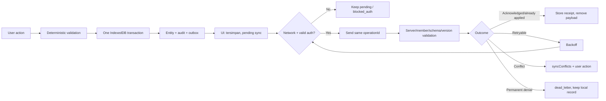

# 08 — Offline-first and Synchronization

Status: **Proposed**. Tidak ada IndexedDB runtime pada Fase 0.

## Prinsip

Offline-first berarti domain command valid dapat selesai pada storage lokal tanpa jaringan, status pending terlihat, dan pengiriman ulang tidak menciptakan transaksi kedua. Ini tidak berarti semua izin berlaku selamanya offline atau cloud selalu sama dengan perangkat.

## Database dan object store

Nama logical database proposed: `vitanusa-mandiri`, version integer berurutan. Semua tenant record memakai compound prefix `accountScope` dan `workspaceId`; anonymous learning memakai account scope lokal terpisah. Repository layer wajib menambahkan scope, sehingga UI tidak dapat menjalankan query global.

| Store | Primary key | Index utama | Catatan |
| --- | --- | --- | --- |
| `workspaces` | `[accountScope, workspaceId]` | `status`, `updatedAtLocal` | Metadata lokal, bukan bukti membership cloud |
| `memberships` | `[accountScope, workspaceId, uid]` | `uid`, `[workspaceId,status]` | Simpan permissionVersion dan expiry snapshot |
| `products` | `[accountScope, workspaceId, productId]` | SKU normalized, `active`, `categoryId`, name search key | Tidak simpan HTML |
| `categories` | `[accountScope, workspaceId, categoryId]` | `active`, `sortKey` | Soft inactive |
| `inventoryBalances` | `[accountScope, workspaceId, productId]` | `version` | Snapshot dapat dibangun ulang |
| `stockMovements` | `[accountScope, workspaceId, movementId]` | `[productId,createdAtLocal]`, `operationId` unique logical | Append-only |
| `sales` | `[accountScope, workspaceId, saleId]` | `receiptNumber`, `cashSessionId`, `status`, `finalizedAtLocal` | Final immutable |
| `saleReversals` | `[accountScope, workspaceId, reversalId]` | `originalSaleId`, `operationId`, `createdAtLocal` | Append-only; original Sale tidak diubah |
| `saleLines` | `[accountScope, workspaceId, saleId, lineNo]` | `productId`, `saleId` | Atomic dengan sale |
| `payments` | `[accountScope, workspaceId, paymentId]` | `saleId`, `cashSessionId` | MVP cash |
| `expenses` | `[accountScope, workspaceId, expenseId]` | `cashSessionId`, `occurredAtLocal`, `status` | Note bounded |
| `cashMovements` | `[accountScope, workspaceId, movementId]` | `cashSessionId`, `type`, `sourceEntityId`, `operationId` | Append-only; signed integer delta |
| `cashSessions` | `[accountScope, workspaceId, sessionId]` | `[status,openedAtLocal]`, `openedByUid` | Constraint open session di domain transaction |
| `learningContent` | `[contentVersion, entityType, entityId]` | course/module/order | Public package, checksum |
| `learningProgress` | `[accountScope, progressId]` | `courseId`, `state`, `lastPracticedAtLocal` | User-private |
| `syncOutbox` | `[accountScope, operationId]` | `status`, `nextAttemptAt`, `workspaceId`, `createdAtLocal` | Payload schema-specific |
| `syncConflicts` | `[accountScope, conflictId]` | `workspaceId`, `entityType`, `status` | Bounded snapshots/redacted diff |
| `metadata` | `key` | none | DB version, device pseudonym, content manifest |

Planned tambahan saat domain membutuhkannya: `auditEvents`, `agentActionDrafts`, `exportJobs`, dan `importJobs`. Store hanya ditambah melalui migration version baru.

## Atomic local command

Satu `finalizeSale` membuka satu IndexedDB transaction pada sale, lines, payment, stock movements, `CashMovement sale_cash`, audit event, dan outbox. Bila satu put gagal, semuanya abort. UI baru menyatakan sukses lokal setelah transaction complete, bukan setelah object dibuat di memori.

## Outbox flow



UI success lokal tidak disamakan dengan cloud acknowledgement. Outbox payload dihapus hanya setelah receipt dan entity server version tersimpan atomik secara lokal.

## Operation contract

Setiap record wajib memiliki:

```text
operationId, workspaceId, entityType, entityId, operationType,
payloadVersion, payload, baseVersion, createdAtLocal,
attemptCount, status, nextAttemptAt, lastErrorCode
```

Server/validator menyimpan `operationId`, actor, workspace, canonical payload hash, result entity/version, dan timestamp. Payload sama di-replay mengembalikan receipt yang sama. Hash berbeda pada ID yang sama menghasilkan `idempotency_mismatch`; server tidak memilih salah satu diam-diam.

## Konflik per entity

### Product

- Update memakai `baseVersion`; perubahan field berbeda dapat ditawarkan sebagai merge preview, tetapi tidak auto-merge harga.
- Harga berubah selalu membuat audit event dengan before/after hash dan actor.
- Jika harga cloud berubah saat keranjang lokal aktif, sale memakai price snapshot yang dikonfirmasi; kebijakan menerima harga lama atau meminta reprice harus diputuskan sebelum Fase 3.

### Inventory

- Jangan sync `InventoryBalance` sebagai angka akhir.
- Sync movement append-only: opening, in, sale, adjustment, void reversal.
- Balance cloud dihitung/diterima dari movements dan dibandingkan dengan snapshot. Divergence membuat conflict, bukan overwrite.
- Stok negatif: default reject saat online. Kebijakan offline oversell memerlukan owner decision; rekomendasi MVP adalah block bila saldo lokal tidak cukup dan tandai risiko saldo stale.

### Sale

- Sale final immutable dan operationId unique.
- Tidak ada last-write-wins.
- Void/correction/reversal membuat entity dan movements baru yang merujuk original.
- Dua perangkat membuat sale berbeda dengan UUID berbeda; receipt numbering final dapat dialokasikan lokal dengan device prefix atau direkonsiliasi server—Needs validation.

### Learning progress

- Key merge adalah learner + course + lesson + contentVersion.
- `attemptCount` digabung sebagai operasi/attempt unique, bukan menambah counter mentah dua kali.
- Best score memakai maksimum score untuk versi konten yang sama.
- State tidak turun otomatis; reset pengguna adalah operation eksplisit.
- Waktu terbaru hanya untuk display setelah server normalization, bukan penentu penguasaan.

## Retry classification

| Kondisi | Status/tindakan |
| --- | --- |
| Offline/DNS/timeout/5xx | Retry exponential backoff dengan jitter |
| 429/resource exhausted | Hormati retry hint, batasi concurrency |
| Auth expired | `blocked_auth`; minta login, jangan loop |
| Permission denied | Permanent sampai membership berubah; tampilkan reason aman |
| Schema version unknown | `dead_letter`; minta update aplikasi/export backup |
| Version conflict | `conflict`; user/domain resolver |
| Idempotent receipt exists | Acknowledged; jangan membuat entity baru |
| Payload mismatch/replay abuse | Permanent deny + audit |

Backoff proposed: mulai 2 detik, eksponensial dengan jitter, maksimum 5 menit selama app aktif. Setelah sejumlah percobaan yang ditetapkan (proposed 10, Needs validation), pindah ke `dead_letter` tanpa menghapus entity lokal. Retry juga berjalan saat app dibuka, saat event `online`, dan ketika pengguna menekan **Coba sinkronkan**. Background Sync API hanya enhancement.

## Versioning dan migration

1. Setiap migration murni, idempotent bila upgrade diulang, dan tidak melakukan network.
2. Sebelum migration berisiko, buat checkpoint metadata dan sarankan backup bila data besar.
3. Jangan menghapus store lama dalam versi yang sama dengan transform; tandai deprecated lalu hapus setelah satu versi stabil.
4. Bila record gagal dimigrasi, pindahkan metadata error minimal ke quarantine/conflict dan pertahankan raw backup lokal sampai pengguna memilih tindakan.
5. Downgrade app tidak boleh membuka schema lebih baru sebagai writable.

## Encryption limitations dan perangkat bersama

IndexedDB dilindungi oleh same-origin/browser sandbox, bukan enkripsi aplikasi end-to-end. Pengguna yang menguasai profil browser/perangkat atau script same-origin berbahaya dapat membaca data. Jangan menyimpan token, password, raw invitation token, data kesehatan, atau free-text sensitif yang tidak diperlukan.

Pada logout:

- tutup koneksi database dan hentikan sync;
- hapus state auth/action draft dari memori;
- tawarkan pilihan **Simpan data offline untuk login berikutnya** atau **Hapus data akun dari perangkat ini** dengan penjelasan;
- default perangkat bersama yang diaktifkan pengguna adalah purge accountScope setelah memastikan outbox/export backup;
- jangan otomatis mengunggah anonymous learning progress saat akun lain login.

Switch account mengubah `accountScope`; repository menolak akses ke scope lama. Service worker tidak menyimpan response tenant.

## Storage pressure dan cleanup

Pantau `navigator.storage.estimate()` sebagai UX hint, bukan jaminan. Cleanup otomatis hanya untuk package publik versi lama, expired action draft, file export temporer, dan receipt yang melewati retention. Sale, movement, expense, progress, conflict, serta outbox tidak boleh dihapus otomatis karena quota. Bila quota rendah, hentikan transaksi baru dengan pesan dan tawarkan export/cleanup aman.

## Sync acceptance

- restart tidak menghilangkan pending sale;
- repeated send menghasilkan satu sale;
- conflict tidak menimpa entity final;
- account switch tidak menunjukkan data scope lama;
- permission revoked menghentikan write berikutnya;
- jam perangkat salah tidak mengubah urutan server;
- partial acknowledgement dapat dilanjutkan tanpa duplicate;
- migration failure tidak menghapus backup.
