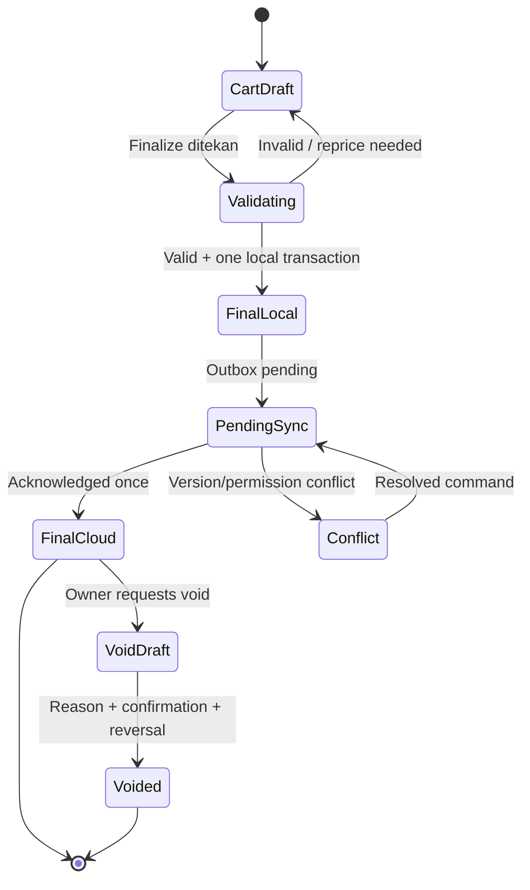

# 09 — NusaKasir Domain Rules

Status: **Proposed**. NusaKasir belum diimplementasikan. Aturan ini menjadi kontrak untuk fungsi murni, repository, UI, sync, dan laporan.

## Sumber kebenaran

Nilai final berasal dari input pengguna yang telah dikonfirmasi, entity committed, domain rules deterministik, dan database. LLM tidak menentukan harga, total, stok, role, selisih kas, atau status pembayaran.

## Produk

Field minimum:

```text
name
sku optional
categoryId optional
purchasePriceMinor optional
sellingPriceMinor
stockTracking
active
```

Aturan:

- `name` adalah plain text 1–160 karakter; render dengan `textContent`.
- SKU opsional, dinormalisasi case-insensitive per workspace, dan konflik tidak di-overwrite.
- Harga beli opsional; ketidakhadirannya membuat estimasi HPP/laba tidak lengkap.
- Harga jual integer rupiah dan boleh nol hanya bila owner mengaktifkan kebijakan barang gratis; rekomendasi MVP adalah harga nol ditolak untuk menghindari salah input.
- Produk inactive tidak boleh ditambahkan ke keranjang baru, tetapi sale lama tetap menampilkan snapshot.
- `stockTracking=false` berarti movement stok tidak dibuat; bukan berarti stok tak terbatas yang dapat diklaim.
- Data produk berasal dari pemilik usaha. Sistem/Agent tidak mengarang produk, harga, komposisi, BPOM, halal, atau manfaat kesehatan.

## Kalkulasi penjualan

Untuk line dengan kuantitas bulat MVP:

```text
lineGrossMinor = quantityScaled × unitPriceMinor / quantityScale
lineSubtotalMinor = lineGrossMinor - lineDiscountMinor
subtotalMinor = sum(lineSubtotalMinor)
grandTotalMinor = subtotalMinor - saleDiscountMinor
changeMinor = amountPaidMinor - grandTotalMinor
```

Setiap pembagian fixed-point memakai aturan pembulatan integer terdokumentasi. Untuk kuantitas bulat `quantityScale=1`, tidak ada pembulatan.

### Validasi edge case

| Kasus | Kebijakan MVP proposed |
| --- | --- |
| Keranjang kosong | Finalize ditolak |
| Quantity nol/negatif | Ditolak |
| Quantity pecahan | Ditolak sampai fixed-point decision diterima |
| Produk timbang | Deferred |
| Harga nol | Ditolak default; owner policy belum diputuskan |
| Diskon > subtotal | Ditolak |
| Pembayaran kurang | Ditolak; hutang bukan MVP |
| Pembayaran berlebih | Diizinkan untuk cash; kembalian dihitung integer |
| Split payment | Deferred |
| Produk inactive | Tidak boleh masuk cart baru |
| Stok lokal tidak cukup | Finalize ditolak untuk stock-tracked product |
| Harga berubah saat cart aktif | Tampilkan diff dan minta konfirmasi; jangan diam-diam ganti |
| Duplikasi klik | Command guard + operationId yang sama |

Diskon dapat dimasukkan sebagai nominal integer. Persentase, bila kelak ada, dikonversi dengan basis points dan hasil nominalnya disimpan. Sale final menyimpan snapshot harga dan diskon sehingga laporan tidak berubah ketika master product diperbarui.

## Transaction lifecycle



`CartDraft` bukan transaksi dan tidak masuk laporan. `FinalLocal` sudah menjadi sale immutable di perangkat. Sinkronisasi tidak boleh mengubahnya menjadi sale lain. Void membuat koreksi terhubung, bukan menghapus original.

## Finalize sale atomik

Satu transaksi local repository wajib membuat:

1. `Sale` final;
2. seluruh `SaleLine` snapshot;
3. `Payment` recorded;
4. `StockMovement` bertipe `sale` untuk produk tracked;
5. `CashMovement sale_cash` pada sesi yang sama;
6. `AuditEvent sale_created`;
7. `SyncOperation` dengan operation ID yang sama.

Tidak ada state setengah jadi. Receipt hanya dibuat dari hasil committed.

## Inventori

- Ledger movement adalah sumber rekonstruksi; `InventoryBalance` adalah snapshot performa.
- Opening stock, purchase/in, sale, adjustment, dan void reversal menggunakan type/reason yang berbeda.
- Adjustment memerlukan alasan, actor, timestamp, dan permission owner.
- Saldo tidak ditulis langsung dari UI.
- Offline oversell dua perangkat adalah risiko penting. Sebelum multi-device pilot, diperlukan reservation/availability policy atau conflict workflow; local MVP satu perangkat tidak mengklaim menyelesaikan masalah ini.
- Negative balance tidak boleh disembunyikan. Bila conflict menghasilkan negative projected balance, workspace masuk review inventory tanpa mengubah sale final.

## Estimasi laba kotor

Gunakan istilah **estimasi laba kotor**:

```text
penjualan bersih - estimasi harga pokok barang terjual
```

HPP line memakai `purchasePriceSnapshotMinor × quantity`. Line tanpa harga beli tidak dihitung sebagai HPP nol; ia menambah counter `linesWithoutCost` dan laporan menyatakan estimasi tidak lengkap.

Disclaimer wajib: laporan ini bukan laporan akuntansi atau pajak resmi, belum memperhitungkan seluruh biaya, dan harga beli opsional dapat membuat estimasi tidak lengkap. Pengeluaran tercatat ditampilkan terpisah; jangan menyebut pengurangan pengeluaran dari laba kotor sebagai laba bersih tanpa model akuntansi yang disetujui.

## Cash session

```text
Open Cash Session
  opening cash
  + cash sales
  + explicit cash in
  - cash expenses
  - explicit cash out
  - sale reversals
= Expected Cash

Counted Cash - Expected Cash = Cash Difference
```

Aturan:

- satu sesi open per kasir/perangkat atau workspace harus dipilih sebelum implementasi; rekomendasi local MVP satu sesi workspace pada satu perangkat;
- opening cash dan counted cash adalah integer;
- setiap sale tunai, expense tunai, cash in, cash out, dan sale reversal membuat `CashMovement` append-only dengan signed integer, source ID, actor, reason, serta operation ID;
- cash in/out manual hanya oleh `merchant_owner` pada MVP, memerlukan reason dan konfirmasi; cash out manual bukan Expense dan tidak memengaruhi estimasi laba;
- `Expected Cash = openingCashMinor + sum(amountDeltaMinor)`; UI tidak boleh menulis expected cash langsung;
- close memerlukan preview expected/count/difference dan konfirmasi;
- closed session immutable;
- close tidak menghapus atau memindahkan sale;
- selisih tidak otomatis menjadi pengeluaran atau pendapatan;
- Agent tidak boleh menutup sesi.

## Void/correction

Void normal hanya oleh `merchant_owner` pada MVP dan wajib mencatat:

```text
reasonCode
reasonNote bounded optional
actorUid
timestamp local/server
originalSaleId
voidOperationId
reversal stock movements
payment/cash reversal reference
```

Original sale dan line tetap tidak berubah. Status `voided` pada tampilan/report adalah hasil join dengan entity append-only `SaleReversal`; bukan field Sale yang di-update. Refund dana ke pelanggan tidak termasuk MVP dan tidak boleh disamakan dengan void pencatatan.

## Receipt

Receipt memuat nama workspace snapshot, nomor, waktu transaksi, item, jumlah, harga, total, pembayaran, dan kembalian. Nama produk dirender sebagai text dan disanitasi saat export. Receipt tidak menyebut faktur pajak, bukti pembayaran bank, status halal, atau klaim kesehatan kecuali data dan proses terpisah kelak disetujui.

## Reason codes dan invariant tests

Reason code utama: `empty_cart`, `invalid_quantity`, `unsafe_integer`, `inactive_product`, `insufficient_local_stock`, `price_changed`, `discount_exceeds_subtotal`, `underpayment`, `cash_session_required`, `duplicate_operation`, `sale_immutable`, dan `owner_permission_required`.

Unit test wajib membuktikan total tiap line, total sale, pembulatan fixed-point bila diaktifkan, kembalian, diskon boundary, snapshot price, insufficient stock, duplicate command, rollback atomik, void reversal, HPP tidak lengkap, dan cash difference.
