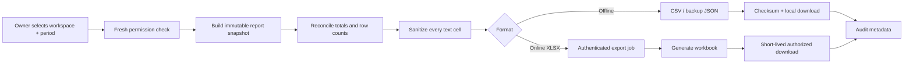

# 11 — VitaSheet Workbook Specification

Status: **Proposed; generator XLSX belum diimplementasikan**.

## Nama dan snapshot

```text
VitaNusa-Mandiri-Laporan-{workspace}-{periode}.xlsx
```

`workspace` disanitasi menjadi slug aman tanpa data pribadi berlebih; `periode` memakai `YYYY-MM-DD_sampai_YYYY-MM-DD`. Export selalu mengikat `workspaceId`, timezone, period start/end, filter status, schema version, dan snapshot cut-off agar seluruh sheet konsisten.

## Aturan workbook umum

- Locale label `id-ID`, currency `IDR`, nilai uang ditulis numeric integer dengan display format `#,##0`; sumber tetap integer.
- Timestamp cloud UTC dikonversi ke timezone workspace untuk display `yyyy-mm-dd hh:mm:ss`; instan UTC dapat disertakan pada audit export.
- Header bold, autofilter, freeze panes, dan text wrapping pada kolom naratif.
- Tidak ada macro, external link, hidden executable content, image remote, atau formula dari input pengguna.
- Maksimum proposed 1.000.000 data rows per sheet (di bawah batas Excel 1.048.576). Lebih besar menghasilkan beberapa file/CSV, bukan truncate diam-diam.
- Dataset kosong tetap membuat sheet, header, dan baris “Tidak ada data untuk periode ini” sebagai teks non-formula.
- Total dihitung domain service dan dapat ditulis numeric; formula workbook dipakai sebagai cross-check, bukan satu-satunya sumber kebenaran.

## 01 Ringkasan

| Properti | Spesifikasi |
| --- | --- |
| Kolom/urutan | `Metrik`, `Nilai`, `Satuan`, `Keterangan` |
| Baris | Periode; jumlah transaksi; penjualan kotor; diskon; penjualan bersih; pengeluaran tercatat; estimasi HPP; estimasi laba kotor; selisih kas; produk terlaris berdasarkan jumlah; stok menipis; line tanpa harga beli |
| Tipe/format | Label text; nilai uang numeric `#,##0`; count integer; periode text/date pair |
| Formula | Cross-check `Penjualan bersih = kotor - diskon`; `Estimasi laba kotor = penjualan bersih - estimasi HPP`; link ke total sheet detail bila library aman |
| Total | Satu nilai per metrik; selisih kas dijumlah dari sesi closed dalam periode |
| Freeze/filter/width | Freeze `A2`; filter optional; A 34, B 20, C 16, D 60 |
| Validasi/empty/max | Nilai cocok report snapshot; label “estimasi”; 100 baris maksimum |

## 02 Transaksi

| Properti | Spesifikasi |
| --- | --- |
| Kolom/urutan | `No`, `Sale ID`, `No Struk`, `Tanggal Lokal`, `Waktu UTC`, `Status`, `Kasir`, `Sesi Kas`, `Subtotal`, `Diskon`, `Penjualan Bersih`, `Dibayar`, `Kembalian`, `Operation ID` |
| Tipe/format | IDs/text aman; date; status enum; uang numeric |
| Formula | Optional row cross-check `Subtotal-Diskon`; final value tetap domain snapshot |
| Total | SUM subtotal, diskon, bersih, dibayar, kembalian; void dipisah dan tidak menggandakan net |
| Freeze/filter/width | Freeze `A2`; filter semua header; ID 38, date 20, uang 16 |
| Validasi/empty/max | Satu row per sale; status display `final/voided` diturunkan dari join `SaleReversal`, bukan update Sale; hingga 1.000.000 rows |

## 03 Detail Barang

| Properti | Spesifikasi |
| --- | --- |
| Kolom/urutan | `Sale ID`, `No Struk`, `Line`, `Product ID`, `SKU`, `Nama Snapshot`, `Quantity`, `Scale`, `Harga Satuan`, `Diskon Line`, `Subtotal Line`, `Harga Beli Snapshot`, `Estimasi HPP Line` |
| Tipe/format | IDs/text; quantity integer scaled plus display; money numeric |
| Formula | `Quantity × Harga Satuan - Diskon` menggunakan nilai display hanya bila exact; HPP blank bila cost absent |
| Total | quantity, subtotal line, dan known HPP; jumlah missing cost dicatat |
| Freeze/filter/width | Freeze `A2`; filter; nama 36, IDs 38, angka 16 |
| Validasi/empty/max | Line order unique per Sale; no negative; 1.000.000 rows |

## 04 Produk

| Properti | Spesifikasi |
| --- | --- |
| Kolom/urutan | `Product ID`, `SKU`, `Nama`, `Category ID`, `Kategori`, `Harga Beli`, `Harga Jual`, `Lacak Stok`, `Aktif`, `Versi`, `Diperbarui` |
| Tipe/format | Text sanitized; money numeric/blank; boolean as `Ya/Tidak`; date |
| Formula/total | Tidak ada formula; counts active/inactive di footer |
| Freeze/filter/width | Freeze `A2`; filter; nama 36, kategori 24, IDs 38 |
| Validasi/empty/max | Harga beli blank diperbolehkan; safe integer; 1.000.000 rows |

## 05 Stok

| Properti | Spesifikasi |
| --- | --- |
| Kolom/urutan | `Product ID`, `SKU`, `Nama`, `Quantity Scaled`, `Scale`, `Saldo Tampil`, `Movement Terakhir`, `Versi`, `Status Rekonsiliasi` |
| Tipe/format | Integer/raw plus display text/numeric exact; enum reconciliation |
| Formula | Display quantity from scaled/scale only with deterministic precision |
| Total | Tidak menjumlah produk dengan unit/scale berbeda; count low/out-of-stock |
| Freeze/filter/width | Freeze `A2`; filter; name 36, status 22 |
| Validasi/empty/max | Balance matches throughMovement/version; 1.000.000 rows |

## 06 Pergerakan Stok

| Properti | Spesifikasi |
| --- | --- |
| Kolom/urutan | `Movement ID`, `Tanggal`, `Product ID`, `SKU`, `Nama`, `Tipe`, `Delta Scaled`, `Scale`, `Delta Tampil`, `Sumber`, `Source ID`, `Alasan`, `Actor`, `Operation ID` |
| Tipe/format | IDs/text; date; signed integer delta; enum type |
| Formula | Tidak mengubah movement; optional running balance hanya per product pada export terurut |
| Total | Total delta per product pada pivot/ringkasan, bukan global mixed unit |
| Freeze/filter/width | Freeze `A2`; filter; IDs 38, alasan 28 |
| Validasi/empty/max | Append-only record; source reference required; 1.000.000 rows |

## 07 Pengeluaran

| Properti | Spesifikasi |
| --- | --- |
| Kolom/urutan | `Expense ID`, `Tanggal`, `Kategori`, `Jumlah`, `Status`, `Sesi Kas`, `Catatan`, `Actor`, `Operation ID` |
| Tipe/format | Date; money numeric; text sanitized; enum |
| Formula/total | SUM seluruh Expense berstatus recorded; koreksi/pembatalan pengeluaran belum termasuk MVP dan tidak dikurangkan diam-diam |
| Freeze/filter/width | Freeze `A2`; filter; catatan 48, IDs 38 |
| Validasi/empty/max | amount > 0; note <= policy; 1.000.000 rows |

## 08 Sesi Kas

| Properti | Spesifikasi |
| --- | --- |
| Kolom/urutan | `Session ID`, `Dibuka`, `Ditutup`, `Status`, `Pembuka`, `Penutup`, `Kas Awal`, `Penjualan Tunai`, `Cash In Manual`, `Pengeluaran Kas`, `Cash Out Manual`, `Reversal`, `Kas Diharapkan`, `Kas Dihitung`, `Selisih` |
| Tipe/format | Date; enums/text; money numeric |
| Formula | Cross-check expected dari opening + signed CashMovement dan difference; stored domain values authoritative |
| Total | SUM numeric columns untuk sesi closed; open dipisah |
| Freeze/filter/width | Freeze `A2`; filter; dates 20, money 17 |
| Validasi/empty/max | closed requires count/difference; 1.000.000 rows |

## 09 Pembatalan

| Properti | Spesifikasi |
| --- | --- |
| Kolom/urutan | `Void ID`, `Original Sale ID`, `No Struk`, `Tanggal`, `Reason Code`, `Alasan`, `Actor`, `Nilai Dibalik`, `Movement Reversal IDs`, `Operation ID` |
| Tipe/format | IDs/text; date; money numeric; joined IDs text safe |
| Formula/total | SUM nilai dibalik; tidak menghapus original sale |
| Freeze/filter/width | Freeze `A2`; filter; alasan 48, IDs 38 |
| Validasi/empty/max | Original dan reversal required; 1.000.000 rows |

## 10 Audit Ekspor

| Properti | Spesifikasi |
| --- | --- |
| Kolom/urutan | `Export ID`, `Dibuat UTC`, `Dibuat Lokal`, `Workspace ID`, `Workspace`, `Periode`, `Timezone`, `Schema Version`, `Snapshot Cutoff`, `Filter`, `Jumlah Baris per Sheet`, `Checksum`, `Peringatan` |
| Tipe/format | Metadata text/date/integer; no raw transaction payload |
| Formula/total | Tidak ada formula |
| Freeze/filter/width | Freeze `A2`; filter optional; metadata value 64 |
| Validasi/empty/max | Tepat satu export metadata block; warning selalu menjelaskan bukan laporan akuntansi/pajak resmi |

## Formula injection defense

Setiap value yang berasal dari user dan dimaksudkan sebagai text dinormalisasi sebagai string. Jika karakter pertama setelah whitespace adalah `=`, `+`, `-`, `@`, tab, carriage return, atau line feed, generator menambahkan apostrophe atau memakai API library untuk cell type string yang tidak dievaluasi. Tab/CR/LF terdepan dibuang atau di-escape sesuai import/export contract.

Defense diterapkan pada nama workspace, produk, SKU, kategori, note, reason, actor display name, serta kolom import error. Nilai numeric tidak pernah dibentuk dari string user tanpa parser integer. Hyperlink hanya dibuat oleh kode dari route internal yang di-allowlist; URL user ditulis text.

## Spreadsheet export flow



Export tidak membaca lintas tenant. Online job mengulang izin saat request dan download. File tidak dilampirkan ke audit log.

## Pilihan teknologi

| Kriteria | A — XLSX client-side | B — FastAPI + openpyxl | C — Hybrid |
| --- | --- | --- | --- |
| Offline | Ya | Tidak | CSV/JSON ya; XLSX tergantung spike |
| Bundle/performa Android | Library besar dan memory pressure | Browser ringan | MVP ringan; XLSX online |
| Kontrol workbook | Bergantung library | Tinggi | Tinggi untuk rich workbook |
| Lisensi/maintenance | Harus review library | openpyxl/license/backend maintenance | Dua jalur, kontrak lebih kompleks |
| Privasi | Data tetap device | Data finansial diproses server | User memilih; minimisasi diperlukan |
| Keamanan | Formula/zip memory di client | Auth/IDOR/temp-file risk | Kedua threat surface, dibatasi per format |
| Hosting/cost | Tidak ada compute server | Compute/storage temp | Online XLSX hanya saat diminta |

Rekomendasi **C — Hybrid**, status `Needs validation`: CSV dan backup JSON offline pada MVP; rich XLSX lewat backend terautentikasi setelah spike privacy, auth, memory, hosting, dan lifecycle file. Bila owner mewajibkan XLSX offline, ADR-005 harus dibuka kembali dan library client dinilai lisensi/bundle/performa. Tidak ada library ditambahkan pada Fase 0.
