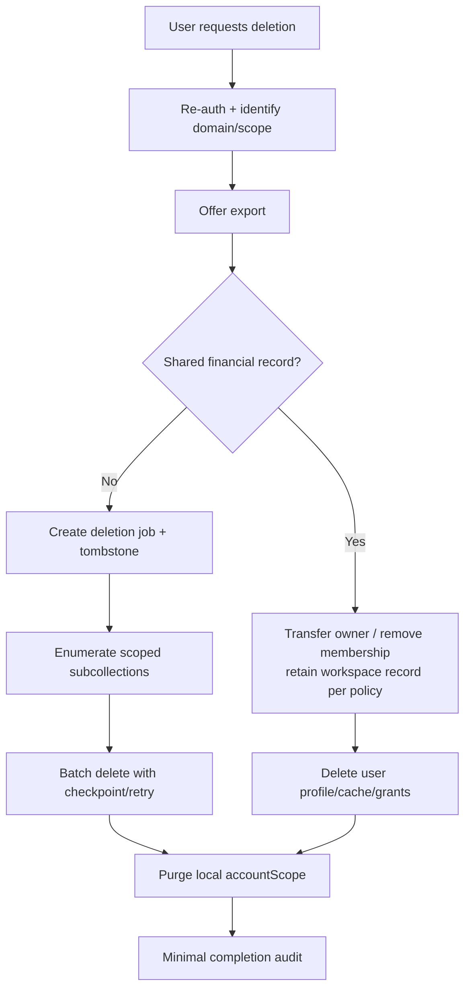

# 13 — Privacy and Data Governance

Status: **Proposed**. Retention finansial, emergency support access, dan lokasi pemrosesan XLSX memerlukan keputusan owner/legal sebelum pilot.

## Klasifikasi

| Kelas | Contoh | Aturan utama |
| --- | --- | --- |
| Public | Course published, artikel, metadata aplikasi | Dapat dicache setelah integrity check |
| Internal | Draft materi, reason code, metadata operasional minimal | Staff sesuai tugas; bukan publik |
| Tenant-private | Produk, kategori, membership | Hanya anggota workspace sesuai role |
| User-private | Preferensi dan profil minimal | Hanya UID pemilik |
| Sensitive financial | Sale, payment, expense, cash session, profit estimate | Tenant role ketat, export/audit, retention khusus |
| Sensitive educational | Attempt, progress, mentor grant | Learner owner; mentor consent scoped |
| Health-related | Riwayat VitaCheck | UID pemilik saja sesuai Rules existing |
| Credential | Token auth, service credential, invitation secret | Tidak disimpan frontend/log/export; raw invite token berumur pendek |

## Data inventory

| Data | Klasifikasi | Pemilik/controller operasional | Tujuan | Retention proposed | Export/delete |
| --- | --- | --- | --- | --- | --- |
| UserProfile | User-private | User | Preferensi Mandiri | Sampai dihapus | User |
| Workspace metadata | Tenant-private | Workspace | Operasi toko | Workspace aktif + grace | Owner |
| Membership | Tenant-private | Workspace/member | Otorisasi | Aktif + audit minimum | Owner/member own record |
| Produk/stok | Tenant-private | Workspace | Operasi kasir | Workspace lifecycle | Owner |
| Sale/payment/expense/cash | Sensitive financial | Workspace | Pencatatan usaha | Needs legal/business decision | Owner; deletion restricted by policy |
| Audit event | Internal tenant | Workspace | Accountability/security | Proposed 12 bulan, needs validation | Owner, redacted |
| Learning progress/attempt | Sensitive educational | Learner | Menampilkan progres | Sampai user menghapus | Learner |
| Mentor grant | Sensitive educational/access | Learner | Consent | Grant + short audit | Learner |
| VitaCheck history | Health-related | User | Riwayat refleksi opsional | Existing user-controlled | User only |
| Agent draft | Tenant/user-private | Actor | Preview tindakan | Proposed <=24 jam | Tidak default |
| Chat memory | Health-adjacent transient | Session | Phrasing conversation | Existing in-memory TTL | Tidak menjadi Mandiri record |
| Export/import temp file | Sensitive | Requestor/workspace | Portability | Hapus segera/expiry | Requestor only |
| Auth token | Credential | Firebase/runtime | Authentication | SDK-managed; tidak dicatat | Tidak |

## Pemisahan domain

Data kesehatan, pembelajaran, usaha, dan platform admin tidak ditempatkan dalam satu profil raksasa dan tidak digabung untuk scoring. Path, repository, permission, audit category, export, retention, dan deletion flow terpisah.

- Data kesehatan tidak masuk report usaha, learning recommendation, Agent action log, atau mentor view.
- Data belajar tidak memengaruhi role kasir, harga, kredit, atau marketing.
- Data usaha tidak dipakai untuk diagnosis, materi adaptif, atau iklan.
- Platform admin tidak membaca tenant/private data hanya karena role platform.

UID dapat menjadi common identity reference, tetapi join lintas domain dilarang kecuali use case, consent, policy, dan test baru disetujui.

## Data minimization dan purpose limitation

- Produk tidak menyimpan nomor telepon/customer profile pada MVP.
- Sale tidak menyimpan nama pelanggan.
- Audit menyimpan ID/hash/reason, bukan full payload/note/chat.
- Learning attempt tidak menyimpan free-text bila exercise tidak memerlukannya; MVP menghindari free-text assessment.
- Device ID adalah pseudonymous random installation ID, dapat direset, dan bukan advertising ID/fingerprint.
- Export online menerima snapshot yang diperlukan saja dan menghapus temp file.
- Analytics baru, background tracking, lokasi, kontak, SMS, kamera, mikrofon, dan clipboard monitoring tidak termasuk.

## Consent model

Consent harus spesifik, informed, revocable, dan tidak dibundel:

- cloud sync learning terpisah dari login;
- mentor grant memilih mentor/scope/expiry;
- cloud workspace sync dijelaskan saat diaktifkan;
- export mengungkap format dan data;
- data kesehatan tetap memakai consent VitaCheck existing;
- anonymous local data tidak otomatis dipindahkan saat login.

Catat versi consent, waktu server, scope, dan revoke tanpa menyimpan copy teks pribadi. Revoke menghentikan akses baru; offline cache pihak penerima dibersihkan pada koneksi berikutnya, dengan residual risk dijelaskan.

## Data deletion flow

User account deletion tidak boleh menghapus sale milik workspace bersama. Owner terakhir harus transfer ownership atau memilih workspace deletion workflow. Learning/VitaCheck user-private dapat dihapus oleh pemilik sesuai masing-masing kontrak. Tombstone tidak memuat payload yang dihapus.

## Export dan portability

Export owner hanya memuat workspace aktif yang dipilih. Learner export terpisah dari bisnis. VitaCheck export, bila kelak ada, terpisah lagi. File diberi warning sensitivitas dan tidak di-email otomatis. Formula injection, IDOR, temporary URL expiry, checksum, dan duplicate job diuji.

## Retention dan backup

Retention final tidak diputuskan pada Fase 0. Sebelum pilot owner harus menentukan kebutuhan hukum/operasional untuk transaksi, audit, deletion grace, invitation, sync receipt, dan backup. Default teknis tidak boleh berarti “selamanya”.

Backup JSON:

- versioned, checksum, workspace-scoped, dan dibuat atas permintaan;
- tidak memuat token, service credential, health, atau data workspace lain;
- restore selalu melalui preview/schema validation dan explicit confirm;
- modifikasi/tamper menghasilkan warning/error; checksum bukan tanda tangan keaslian mutlak;
- lokasi file berada di kontrol pengguna, sehingga aplikasi menjelaskan risikonya.

Cloud backup/provider behavior perlu dokumentasi terpisah sebelum produksi. Device loss tanpa cloud sync atau backup berarti data local-only dapat hilang; UI harus jujur.

## Logout dan shared Android device

Logout menghentikan sync, membersihkan auth/action state, menutup database, dan menawarkan purge data akun lokal. Default tidak menghapus cloud atau backup. Account switch memakai namespace terpisah dan tidak menampilkan recent product/report akun sebelumnya. Screenshot/Android recent-app preview dan downloaded export tetap residual risk; screen privacy mode dapat dipertimbangkan kemudian tanpa klaim sempurna.

## Incident response

1. Triage scope: domain, workspace/user, waktu, versi app, dan exposure path.
2. Hentikan jalur write/read berisiko melalui feature flag tanpa menghapus local data.
3. Preserve audit metadata minimal dan jangan menyalin payload ke chat/ticket umum.
4. Rotasi credential bila relevan; revoke invitation/session sesuai authority.
5. Notifikasi pihak terdampak dengan fakta terverifikasi dan langkah pemulihan.
6. Patch + regression/Rules test + reviewed rollout.
7. Post-incident review memperbarui threat/risk/ADR.

## Platform support access

Tidak ada support backdoor pada rancangan ini. Pertanyaan apakah platform owner dapat membantu restore tenant dalam keadaan darurat tetap terbuka. Rekomendasi: jangan beri raw read; gunakan backup terenkripsi/tenant-authorized support grant yang time-bound, purpose-bound, audited, dan membutuhkan dua pihak. Ini tidak memblokir Fase 1 local-only tetapi memblokir desain recovery production.

## Privacy acceptance

- query/report/export tidak pernah lintas workspace;
- mentor revoke/expiry menolak read;
- platform roles gagal membaca tenant/learning/health;
- local purge hanya accountScope terpilih;
- audit/log/error tidak membawa full financial payload, prompt, token, atau health text;
- service worker tidak cache tenant response;
- deletion dapat dilanjutkan setelah partial failure dan menghasilkan completion state.
