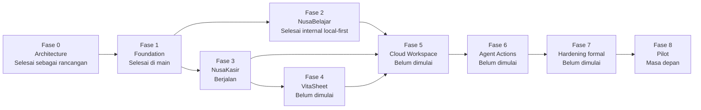

# 17 — Phased Roadmap dan Status Aktual

Status dokumen: **diselaraskan dengan `main` pada 24 Juli 2026**.

Dokumen ini membedakan rencana produk dari bukti implementasi. Sebuah fitur hanya disebut selesai bila kode, halaman atau fondasi, dan test yang relevan benar-benar tersedia di branch `main`. Roadmap, ADR, diagram, atau dokumen spesifikasi tidak dihitung sebagai bukti implementasi dengan sendirinya.

Lihat juga [current-status.md](current-status.md) untuk inventaris halaman, versi IndexedDB, versi backup, object store, test, dan keterbatasan aktual.

## Legenda status

| Status | Arti |
| --- | --- |
| **Selesai di `main`** | Implementasi telah merge dan tersedia pada `main`, tetapi tetap tunduk pada feature flag serta batas local-only/internal. |
| **Sedang direview / belum merge** | Ada PR terbuka atau branch kerja yang belum menjadi bagian `main`. Tidak boleh dihitung sebagai fitur tersedia. |
| **Belum dimulai** | Tidak ditemukan implementasi aktual pada `main` maupun PR terbuka yang relevan. |
| **Rencana masa depan** | Arah produk setelah dependency dan gate sebelumnya terpenuhi; belum menjadi komitmen rilis. |

## Ringkasan fase

| Fase | Status aktual | Ringkasan |
| --- | --- | --- |
| Fase 0 — Architecture | **Selesai di `main` sebagai paket rancangan** | Charter, scope, model data, threat model, test strategy, ADR, dan risk register tersedia. Sebagian pernyataan status di dokumen lama bersifat historis dan bukan status runtime terkini. |
| Fase 1 — Foundation | **Selesai di `main`** | Feature flag, shell, workspace local-only, role lokal, utility money/ID, audit, repository scoped, IndexedDB, backup JSON, dan recovery preview-only tersedia. |
| Fase 2 — NusaBelajar MVP | **Selesai di `main` untuk scope internal local-first** | Paket konten published/approved, katalog, lesson reader, lima tipe latihan, kuis, attempt/progress lokal, rekomendasi deterministik, backup, dan offline hardening tersedia. |
| Fase 3 — NusaKasir Local MVP | **Sedang berjalan; sebagian besar fondasi telah selesai di `main`** | Produk, inventory, cart draft, sale final, payment tunai, receipt snapshot, dan pengurangan stok telah tersedia sebagai domain/persistensi. UI publik internal baru tersedia untuk produk dan inventory; checkout belum tersedia. |
| Fase 4 — VitaSheet | **Belum dimulai sebagai fase** | Backup JSON versioned dan recovery preview sudah tersedia sebagai fondasi lintas fase. CSV laporan, import preview, report snapshot, dan XLSX belum tersedia. |
| Fase 5 — Cloud Workspace | **Belum dimulai** | Tidak ada tenant Firestore Mandiri, outbox sync, conflict store, invitation cloud, atau multi-device sync. |
| Fase 6 — NusaAgent Actions | **Belum dimulai** | Nusa Agent tetap informasional. Tidak ada action draft/confirmation/execute Mandiri. |
| Fase 7 — Security & Hardening | **Belum dimulai sebagai fase formal** | Hardening dan regression test dilakukan per PR, tetapi matrix cloud, chaos lintas perangkat, deletion, retention, dan security review penuh belum tersedia. |
| Fase 8 — Pilot | **Rencana masa depan** | Belum ada bukti pilot UMKM/learner, physical-device matrix lengkap, onboarding pilot, atau readiness produksi. |

## Alur fase

Fase 2 dan Fase 3 berjalan setelah fondasi Fase 1 stabil, tetapi tidak harus selesai dalam satu release. Cloud tetap menunggu domain lokal dan model konflik stabil. Pilot tidak boleh dipakai sebagai pengganti security test.

## Fase 1 — Foundation

**Status aktual: selesai di `main` untuk fondasi internal local-only.**

### Tersedia di `main`

- feature flag `VITE_VITANUSA_MANDIRI_STATE` dengan state `off|internal` dan default aman `off`;
- dashboard `mandiri/index.html`;
- workspace lokal dan initial `merchant_owner` yang dibuat atomik;
- model permission lokal `merchant_owner` dan `cashier`;
- utility integer rupiah, ID, payload digest, idempotency, dan audit minimal;
- IndexedDB versioned, migration non-destruktif, repository scoped, dan memory fake untuk test;
- backup JSON versioned dengan checksum;
- halaman `mandiri/recovery.html` untuk validasi dan preview backup tanpa write;
- suite test domain, storage, repository, service, backup, security boundary, shell, dan recovery.

### Batas yang tetap berlaku

- fitur bersifat internal dan local-only;
- login tidak sama dengan permission workspace;
- tidak ada restore commit;
- tidak ada cloud backup atau cloud sync;
- tidak ada klaim production-ready.

## Fase 2 — NusaBelajar MVP

**Status aktual: selesai di `main` untuk scope internal local-first yang didefinisikan oleh dokumen Fase 2.**

### Tersedia di `main`

- feature flag `VITE_NUSABELAJAR_STATE`, aktif hanya bersama Mandiri internal;
- domain Program, Course, Module, Lesson, Activity, Exercise, Quiz, Attempt, dan Progress;
- evaluator deterministik untuk `single_choice`, `multiple_choice`, `numeric_input`, `short_text_exact`, dan `sequence`;
- paket `money-basics-id-v1` berstatus `published` dan `approved`;
- katalog `mandiri/belajar/index.html`;
- lesson reader `mandiri/belajar/lesson.html`;
- kuis akhir modul, attempt append-only, progress atomik, best score, dan guest learner scope lokal;
- rekomendasi lesson berikut secara deterministik;
- penyimpanan lokal pada store `learningAttempts` dan `learningProgress`;
- backup dan preview recovery untuk data belajar;
- offline static allowlist dan integritas package tetap diperiksa;
- test domain, package, reader, progress, offline, accessibility, dan phase-exit.

### Belum tersedia

- cloud sync progres;
- mentor grant/invitation;
- export progres khusus learner;
- authoring UI materi;
- banyak paket/course;
- leaderboard, sertifikat, cohort, voice input, atau AI grading;
- klaim production-ready atau hasil uji Android fisik lengkap.

## Fase 3 — NusaKasir Local MVP

**Status aktual: berjalan. Implementasi telah merge sampai fondasi payment dan receipt, tetapi Local MVP penuh belum selesai.**

### Selesai di `main`

| Area | Bukti aktual |
| --- | --- |
| Feature gate | `VITE_NUSAKASIR_STATE`, efektif hanya bersama Mandiri internal. |
| Product domain | Category/Product tervalidasi, integer rupiah, SKU scoped, active/inactive. |
| Product persistence | Store `categories` dan `products`, optimistic version, audit, operation receipt, backup. |
| Product UI | `mandiri/kasir/products.html` untuk daftar, cari, filter, tambah, edit, dan active/inactive. |
| Inventory foundation | Ledger `stockMovements`, snapshot `inventoryBalances`, movement manual, atomicity, backup. |
| Inventory UI | `mandiri/kasir/inventory.html` untuk saldo, histori, opening stock, purchase in, dan adjustment. |
| Cart foundation | `cartDrafts`, `cartLines`, kalkulasi preview, validasi harga/stok, idempotency, backup. |
| Sale/payment/receipt foundation | Finalisasi atomik ke `sales`, `saleLines`, satu payment tunai, receipt snapshot, cart finalized, audit, operation receipt, dan stock movement `sale`. |
| Durability | IndexedDB dan backup telah naik non-destruktif sampai version 6; test membuktikan bundle final bertahan setelah reopen. |

### Belum tersedia dan masih membuka Fase 3

- UI cart dan checkout;
- UI memasukkan pembayaran dan menekan finalisasi;
- halaman riwayat sale/receipt;
- nomor struk human-readable;
- print browser, printer, PDF, atau share receipt;
- expense;
- cash movement dan cash session buka/tutup;
- void/reversal;
- refund pelanggan;
- laporan harian, stok, kas, dan estimasi laba kotor;
- simulasi satu hari operasional melalui UI lengkap;
- restore commit;
- cloud sync dan multi-device.

`Sale`, `SaleLine`, `Payment`, dan `Receipt` yang sudah ada adalah fondasi domain/persistensi. Keberadaan entity tersebut tidak boleh ditulis sebagai “checkout sudah tersedia”.

## Fase 4 — VitaSheet

**Status aktual: belum dimulai sebagai fase mandiri.**

Fondasi yang sudah ada dan dapat dipakai nanti:

- backup JSON versioned sampai format 6;
- checksum SHA-256;
- preview recovery tanpa write;
- validasi scope dan integritas data lintas collection.

Pekerjaan fase yang belum dimulai:

- report snapshot deterministik;
- CSV produk, penjualan, stok, pengeluaran, dan laporan;
- import produk dengan preview sebelum write;
- formula-injection hardening pada output spreadsheet nyata;
- generator XLSX atau backend job XLSX;
- workbook dan reconciliation report.

## Fase 5 — Cloud Workspace

**Status aktual: belum dimulai.**

Tidak tersedia pada `main`:

- koleksi tenant Firestore Mandiri;
- membership/invitation cloud;
- cloud repository;
- `syncOutbox` dan `syncConflicts` sebagai object store aktif;
- operation acknowledgement server Mandiri;
- conflict resolution UI;
- deletion/export job cloud;
- multi-device stock/sale reconciliation.

`firestore.rules` existing untuk fitur VitaNusa lain bukan bukti Cloud Workspace Mandiri.

## Fase 6 — NusaAgent Actions

**Status aktual: belum dimulai.**

Nusa Agent dapat membantu secara informasional, tetapi belum memiliki action registry, action draft, source attribution, confirmation nonce, trusted execution boundary, atau command Mandiri. Tidak ada tindakan finansial yang dijalankan dari chat.

## Fase 7 — Security and Hardening

**Status aktual: belum dimulai sebagai fase formal.**

Test dan hardening telah ditambahkan sepanjang Fase 1–3, termasuk scope isolation, migration, backup, package integrity, idempotency, rollback atomik, dan accessibility. Namun fase ini baru dapat disebut berjalan setelah ada kandidat fitur yang cukup lengkap serta pekerjaan khusus untuk:

- cloud actor/tenant matrix;
- chaos multi-device dan replay server;
- restore commit rehearsal;
- deletion dan retention;
- audit/observability production;
- physical-device matrix;
- security review menyeluruh.

## Fase 8 — Pilot

**Status aktual: rencana masa depan.**

Pilot memerlukan Fase 7, keputusan retention/support, backup dan recovery yang dapat dipakai, onboarding, physical-device validation, serta jalur rollback. Tidak ada broad launch, Play Store, atau klaim production-ready dalam status saat ini.

## Status review dan branch lain

- Pada saat audit, tidak ditemukan PR terbuka yang relevan dengan VitaNusa Mandiri, NusaBelajar, atau NusaKasir.
- PR #79 sudah merged ke `main`, berisi hardening backend umum, dan tidak dihitung sebagai fitur Mandiri yang sedang direview.
- Perubahan pada branch `docs/vitanusa-status-sync` hanya menyelaraskan dokumentasi. Branch ini tidak menjadi bukti fitur produk sampai merge, dan tidak mengubah status implementasi fase.

## Delivery governance

- Setiap status harus diperiksa terhadap `main`, bukan hanya judul PR atau roadmap.
- Fitur pada branch/PR terbuka tetap berstatus belum merge.
- Migration baru tidak boleh menurunkan atau menghapus schema lama secara diam-diam.
- Feature flag mengatur exposure, bukan permission.
- Firestore Rules, backend, schema, konfigurasi, dan deployment memerlukan pekerjaan terpisah yang eksplisit.
- Tidak ada fase yang boleh dinyatakan selesai hanya karena domain model atau dokumen desainnya sudah ada.
