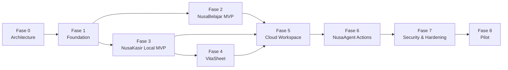

# 17 — Phased Roadmap

Status: **Proposed**. Ukuran `Small|Medium|Large|Extra Large` menunjukkan kompleksitas relatif, bukan estimasi waktu.

## Phased delivery

Fase 2 dan 3 dapat bergerak setelah foundation stabil, tetapi tidak harus dalam satu release. Cloud menunggu domain local matang supaya sync tidak mengaburkan rule yang belum stabil. Pilot menunggu hardening; tidak digunakan sebagai pengganti security test.

## Fase 1 — Foundation

- **Objective:** membuat boundary Mandiri local-only yang dapat dimatikan tanpa mengubah fitur inti.
- **Deliverables:** feature flag; application shell/route; workspace domain types; IndexedDB wrapper dan schema version; repository abstraction; owner/cashier role model lokal; money/ID/idempotency utilities; audit event model; offline status; test harness.
- **Dependencies:** ADR-001/003/006 direview; keputusan kuantitas tidak memblokir utility integer dasar.
- **Likely files/modules:** planned `assets/js/mandiri/`, `assets/css/vitanusa-mandiri.css`, entry HTML/route, `tests/mandiri/`; exact path diputuskan PR pertama.
- **Acceptance:** flag off tidak mengubah build/UI; create local workspace survives restart; account scope isolated; migrations tested; no Firestore/backend write.
- **Out of scope:** lesson engine, sale UI, cloud sync, XLSX, Agent execution.
- **Risks:** shell coupling, premature abstraction, IndexedDB migration bugs.
- **PR breakdown:** 5 PR—flag/shell; pure domain utilities; IndexedDB/repository; audit + workspace local; backup/security integration.
- **Rollback:** disable flag first; revert individual PR; preserve/export DB before destructive schema rollback.
- **Complexity:** Large.

## Fase 2 — NusaBelajar MVP

- **Objective:** pelajaran pendek accessible yang bekerja offline dengan progres local-first.
- **Deliverables:** content schema/package; program/course/module/lesson/activity; exercise/quiz engine; attempt/progress; next-lesson rules; local package/download; accessibility copy.
- **Dependencies:** Fase 1 repository/migration; content reviewer; package size spike.
- **Likely modules:** `mandiri/learning/*`, content package static directory, learning tests.
- **Acceptance:** full learner journey offline; progress persists; score deterministic; no stigmatizing labels; no upload without consent.
- **Out of scope:** mentor cloud access, cohort, formal equivalence, voice input.
- **Risks:** content quality, reading load, storage size, progress version conflict.
- **PR breakdown:** schema/package; lesson renderer; assessment; progress/recommendation; accessibility/offline integration.
- **Rollback:** disable learning flag; keep local progress/export; retain prior content package version.
- **Complexity:** Extra Large.

## Fase 3 — NusaKasir Local MVP

- **Objective:** mencatat satu toko pada satu perangkat tanpa jaringan dengan ledger konsisten.
- **Deliverables:** product/category; inventory movement/balance; cart; deterministic sale/payment; receipt; expense; cash session; void/reversal; local report.
- **Dependencies:** Fase 1; owner decisions on fractional quantity, zero price, cashier close; domain test corpus.
- **Likely modules:** `mandiri/pos/*`, `mandiri/domain/money.js`, repositories and POS UI/tests.
- **Acceptance:** simulated day persists restart; sale final immutable; no duplicate double tap; stock/cash/report reconcile; backup available.
- **Out of scope:** cloud, split payment, debt, refund, printer Bluetooth, barcode, multiple devices.
- **Risks:** arithmetic edge cases, operator error, quota, crash mid-sale.
- **PR breakdown:** products; inventory; cart/sale; payment/receipt; expense/cash; void/report; end-to-end hardening.
- **Rollback:** flag off; read-only/export recovery page for existing DB; never downgrade-write newer schema.
- **Complexity:** Extra Large.

## Fase 4 — VitaSheet

- **Objective:** memberi portability dan laporan yang dapat diperiksa tanpa formula injection.
- **Deliverables:** CSV product/sale/stock/expense; versioned backup JSON; restore preview; import product preview; XLSX proof of concept and decision validation.
- **Dependencies:** stable Fase 3 schema; report snapshot; ADR-005; license/privacy review.
- **Likely modules:** `mandiri/export/*`, `mandiri/import/*`, tests/fixtures; backend PoC only if separately approved.
- **Acceptance:** totals reconcile; empty/large/Unicode/void datasets; injection corpus neutralized; no write before import confirm.
- **Out of scope:** arbitrary XLSX import, macros, scheduled/email reports, tax return.
- **Risks:** memory, corrupt files, unsafe library, misleading totals.
- **PR breakdown:** CSV; backup/restore; import preview; XLSX spike; workbook hardening if accepted.
- **Rollback:** retain CSV/JSON; disable XLSX/import independently; files already downloaded remain user-controlled.
- **Complexity:** Large.

## Fase 5 — Cloud Workspace

- **Objective:** multi-tenant membership and idempotent sync tanpa tenant leakage.
- **Deliverables:** chosen Firestore hierarchy; Rules/indexes; membership/invitation; cloud repository; auth token boundary; sync outbox/receipts; conflict UI; deletion/export jobs.
- **Dependencies:** local domains stable; Firestore/command-boundary spike; >=56 security tests; retention/support decisions.
- **Likely modules:** `mandiri/sync/*`, Firestore adapters, Rules/tests, optional backend domain endpoints through separate reviewed PRs.
- **Acceptance:** A/B isolation; platform roles denied; two-device retry once; revocation; immutable sale; conflict/recovery; cost sample.
- **Out of scope:** multi-branch, global analytics, platform support backdoor.
- **Risks:** Rules/API drift, privileged service, cost, offline revocation latency, sync duplication.
- **PR breakdown:** hierarchy/Rules read-only; membership; product sync; financial sync; learning sync; conflicts/deletion; security/cost hardening.
- **Rollback:** stop cloud writes via flag; preserve outbox/local source; deploy reviewed deny-first Rules rollback separately; no data deletion.
- **Complexity:** Extra Large.

## Fase 6 — NusaAgent Actions

- **Objective:** memperluas Agent existing menjadi pembuat draft aman dan command terbatas.
- **Deliverables:** action registry/schemas; source attribution; preview; nonce/expiry; confirmation UI; fresh permission; idempotent command; audit; safety regression.
- **Dependencies:** Fase 5 trusted boundary; ADR-007; allowed action review; Policy Engine extension design.
- **Likely modules:** `mandiri/agent-actions/*`, backend action schemas/validators only via scoped PR, audit tests.
- **Acceptance:** no mutation from parser/model; generic yes fails; double confirm one receipt; amount recomputed; emergency remains dominant.
- **Out of scope:** sale finalize, void, close cash, membership, bulk price, import commit, deletion, payment, medical actions.
- **Risks:** confusing previews, prompt injection, permission race, unsafe action creep.
- **PR breakdown:** draft-only; preview/UX; confirmation primitives; first one low-risk action; safety hardening.
- **Rollback:** disable executable action flag while informational Agent and forms remain; drafts expire without mutation.
- **Complexity:** Large.

## Fase 7 — Security and Hardening

- **Objective:** menguji kegagalan yang tidak tercakup happy path dan menyiapkan recovery.
- **Deliverables:** full Emulator/API matrix; offline chaos; migration matrix; backup restore drills; device loss/shared-device; deletion; audit retention; penetration/security review; runbooks.
- **Dependencies:** feature-complete candidate from Fase 2–6.
- **Likely files:** test harness, fixtures, runbooks/docs; fixes remain scoped PRs.
- **Acceptance:** all critical/high threat tests; no unresolved tenant/idempotency/money defect; recovery rehearsed; logs minimized.
- **Out of scope:** new product features.
- **Risks:** late architecture defects, migration incompatibility, false confidence from automated tests.
- **PR breakdown:** security tests; offline/migration; privacy/deletion; audit/observability; remediation PRs.
- **Rollback:** freeze rollout, disable flags/action/cloud writes, use last readable schema, follow incident plan.
- **Complexity:** Extra Large.

## Fase 8 — Pilot

- **Objective:** memvalidasi usability dan operasi dengan kelompok kecil yang consented tanpa menyebut production-ready lebih awal.
- **Deliverables:** UMKM pilot; learner pilot; physical Android matrix; onboarding/training; support process; feedback taxonomy; rollback exercise.
- **Dependencies:** Fase 7 gates; owner answers retention/support; privacy notice; backup and incident contacts.
- **Likely changes:** mostly configuration/docs/content; code fixes one issue per PR.
- **Acceptance:** users complete core journeys; no critical privacy/security incident; backups/restores verified; feedback reviewed; rollback works.
- **Out of scope:** broad launch, Play Store, payment processing, unsupported role/branch expansion.
- **Risks:** inadequate training, real-world device/storage variance, support overload, biased pilot feedback.
- **PR breakdown:** pilot flag/config; content/onboarding; fixes as isolated PRs; post-pilot decision doc.
- **Rollback:** stop enrollment, disable cloud/action flags, allow export/read-only recovery, notify participants factually.
- **Complexity:** Large.

## Delivery governance

No phase is merged as one giant PR. Each PR names feature flag, data migration, test evidence, privacy impact, and rollback. Firestore Rules publication, backend deployment, and frontend deployment remain separate authorized operations after merge/review.
