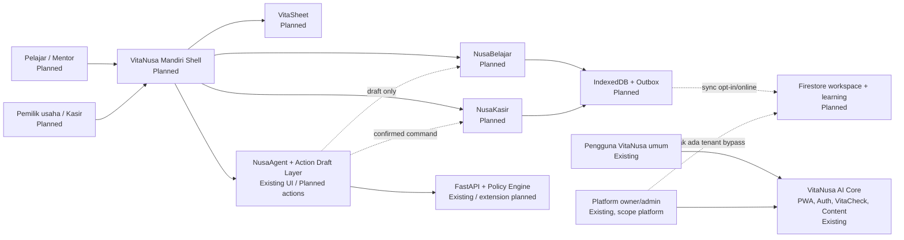

# VitaNusa Mandiri — Arsitektur Fase 0

Dokumen dalam folder ini adalah rancangan teknis **proposed** untuk VitaNusa Mandiri. Dokumen ini tidak berarti NusaBelajar, NusaKasir, VitaSheet, sinkronisasi workspace, atau tindakan NusaAgent telah diimplementasikan. Sumber kode yang ada tetap VitaNusa AI inti; implementasi Mandiri baru boleh dimulai melalui PR kecil setelah keputusan terbuka ditinjau.

## Tujuan paket dokumen

Paket ini menetapkan batas produk, pemisahan data, model domain, model izin, rancangan offline, strategi sinkronisasi, spesifikasi laporan, pagar tindakan AI, strategi pengujian, roadmap, risiko, dan backlog Fase 1. Keputusan berstatus `Proposed` atau `Needs validation` belum boleh diperlakukan sebagai kontrak produksi.

## Peta dokumen

| Dokumen | Kegunaan implementasi |
| --- | --- |
| [00 — Project charter](00-project-charter.md) | Visi, prinsip, bukan tujuan, dan indikator keberhasilan |
| [01 — Audit sistem](01-current-system-audit.md) | Bukti kapabilitas existing, reuse, gap, dan risiko integrasi |
| [02 — Scope produk](02-product-scope.md) | MVP, post-MVP, masa depan, dan out of scope |
| [03 — Pengguna dan journey](03-users-and-journeys.md) | Persona, hak, hambatan, dan alur utama |
| [04 — Domain dan modul](04-domain-and-module-map.md) | Bounded context, dependency, boundary, dan kontrak modul |
| [05 — Role dan permission](05-role-permission-matrix.md) | Pemisahan role platform, workspace, dan belajar |
| [06 — Data model](06-data-model.md) | Entity, field, lifecycle, relasi, uang, waktu, dan ID |
| [07 — Firestore](07-firestore-architecture.md) | Alternatif hierarchy, rekomendasi, pseudo-Rules, dan test keamanan |
| [08 — Offline dan sync](08-offline-first-and-sync.md) | IndexedDB, outbox, idempotency, retry, dan konflik |
| [09 — NusaKasir](09-nusakasir-domain-rules.md) | Aturan produk, penjualan, inventori, kas, void, dan laporan |
| [10 — NusaBelajar](10-nusabelajar-architecture.md) | Konten, aktivitas, progres, offline package, dan consent mentor |
| [11 — VitaSheet](11-vitasheet-workbook-spec.md) | Kontrak CSV/XLSX, tiap sheet, dan formula-injection defense |
| [12 — NusaAgent](12-nusa-agent-action-safety.md) | Informational, draft, konfirmasi, validasi, dan tindakan terlarang |
| [13 — Privasi](13-privacy-and-data-governance.md) | Inventaris data, tujuan, retention, export, deletion, dan insiden |
| [14 — Threat model](14-threat-model.md) | Ancaman, attack path, mitigasi, residual risk, dan test |
| [15 — Test strategy](15-test-strategy.md) | Test pyramid dan acceptance matrix per fase |
| [16 — Observability](16-observability-and-audit-log.md) | Event audit minimal, akses, redaksi, dan ketahanan |
| [17 — Roadmap](17-phased-roadmap.md) | Delapan fase dengan PR, acceptance, risiko, dan rollback |
| [18 — Risk register](18-risk-register.md) | Risiko lintas produk, teknis, privasi, dan operasi |
| [19 — Decision register](19-decision-register.md) | Status keputusan dan pertanyaan yang perlu owner jawab |
| [20 — Backlog Fase 1](20-phase-1-backlog.md) | Enam belas calon issue dan pengelompokan PR |
| [ADR](adr/README.md) | Catatan keputusan arsitektur yang dapat ditinjau satu per satu |

## Konteks sistem

Diagram membedakan komponen existing dan planned. Platform admin mengelola platform dan materi publik, bukan menjadi pembaca data usaha, progres belajar, atau VitaCheck. Garis action Agent tidak mengizinkan model menulis langsung; semua perubahan melewati validasi domain dan konfirmasi.

## Keputusan lintas dokumen

- VitaNusa inti dan Mandiri berbagi shell, auth, prinsip amanah, serta jalur Nusa Chat, tetapi domain kesehatan, belajar, usaha, dan admin disimpan terpisah.
- Fase 1 bersifat local-only dan feature-flagged. Firestore tenant dan sinkronisasi baru direncanakan untuk fase terpisah.
- Nilai uang menggunakan integer dalam unit rupiah untuk `IDR`; floating point dan string berformat bukan sumber perhitungan.
- ID entity dan `operationId` dibuat client dengan UUID v4 menggunakan Web Crypto. Urutan final berasal dari versi server dan timestamp server, bukan ID atau jam perangkat.
- Penjualan final immutable. Koreksi menghasilkan void/reversal dan stock movement baru.
- Sinkronisasi memakai outbox dan operation receipt idempotent; tidak bergantung pada Background Sync API.
- NusaAgent menghasilkan informasi atau draft. Eksekusi hanya setelah konfirmasi eksplisit, pemeriksaan izin baru, validasi deterministik, dan pencatatan audit.
- Strategi XLSX yang direkomendasikan adalah hybrid dan masih `Needs validation`: CSV/backup JSON offline, workbook kaya melalui layanan terautentikasi saat online.

## Cara membaca status

| Status | Arti |
| --- | --- |
| `Existing` | Ditemukan pada repository dan diberi bukti path |
| `Reusable` | Dapat dipakai dengan batas yang disebutkan |
| `Needs extension` | Ada fondasi, tetapi kontrak Mandiri belum ada |
| `Planned` / `Proposed` | Rancangan Fase 0; belum diterapkan |
| `Needs validation` | Membutuhkan spike, keputusan owner, legal review, atau uji perangkat |
| `Deferred` | Sengaja ditunda dari MVP |
| `Out of scope` | Tidak akan dibangun dalam roadmap saat ini tanpa charter baru |

## Guardrail perubahan

Setiap implementasi berikutnya harus menjaga tenant isolation, consent mentor, pemisahan data kesehatan, transaksi immutable, formula-injection defense, dan konfirmasi tindakan Agent. Tidak satu pun ADR mengizinkan deployment langsung, perubahan produksi tanpa review, atau bypass oleh role platform.
